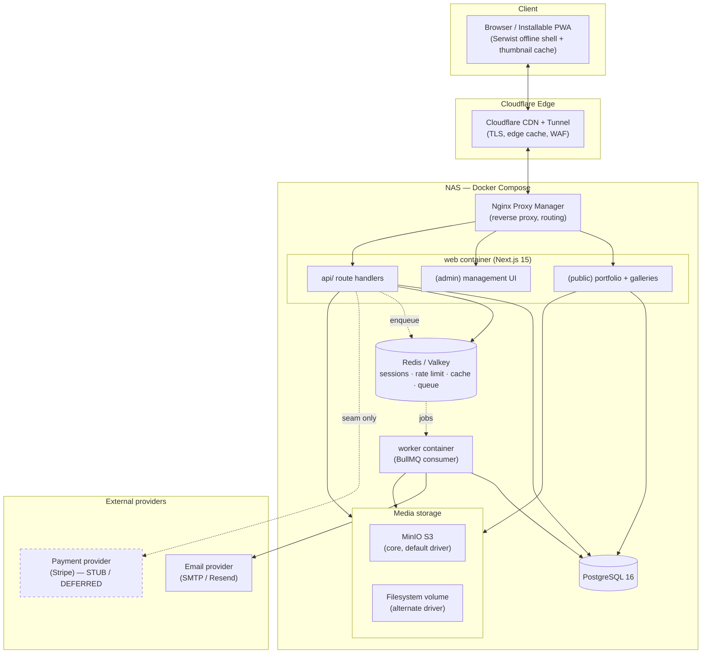

# Architecture

> Phase 0 planning document for a self-hosted photography platform.
> Authoritative companions: [CACHING-STRATEGY.md](./CACHING-STRATEGY.md) and [SECURITY.md](./SECURITY.md).
> Folder/repo layout lives in [FOLDER-STRUCTURE.md](./FOLDER-STRUCTURE.md).

## 1. System Overview

This platform replaces a WordPress/WooCommerce photography site with a self-hosted,
container-based system that reaches the UX bar set by Pixieset, Pic-Time, Format,
and SmugMug while running entirely on a home/office NAS.

The system is intentionally **two long-lived processes that share one codebase**:

1. **`web`** — a single Next.js 15 (App Router) application serving three concerns:
   - the **public portfolio** (Categories: Portraits/Events/Nature, plus Location/travel),
   - the **admin** surface (upload, gallery management, layout config, auth policy),
   - the **API** (route handlers for auth, uploads, gallery access, contact form,
     and the deferred payment seams).
2. **`worker`** — a separate Node process running a **BullMQ** consumer that performs
   all heavy/async work (image derivative generation, EXIF normalization, email send,
   future invoicing jobs). It imports the *same* domain modules as `web` (DB schema,
   storage drivers, image pipeline, email drivers) but never serves HTTP.

Both processes are **stateless**; all durable state lives in **PostgreSQL 16**
(relational data), **Redis/Valkey** (sessions, rate-limit counters, cache, the job
queue), and the **object store** (originals + derivatives, **MinIO S3 by default** with a
filesystem volume driver as a selectable alternate).

The deployment is a **Docker Compose** stack on the NAS. Inbound traffic arrives via a
**Cloudflare Tunnel** (no open ports on the NAS), is terminated/routed by **Nginx
Proxy Manager (NPM)**, and forwarded to the `web` container. Cloudflare doubles as the
edge CDN for cacheable HTML/ISR pages and image bytes.

### Locked stack at a glance

| Concern | Decision |
|---|---|
| Framework | Next.js 15 App Router + React + TypeScript |
| Styling/UI | Tailwind CSS + shadcn/ui; dark mode via `next-themes` |
| Database | PostgreSQL 16, Drizzle ORM (SQL-first) |
| Auth | Better Auth — password + TOTP 2FA + WebAuthn/passkeys, built-in rate limit + lockout |
| Cache/queue | Redis/Valkey (sessions, rate limit, cache) + BullMQ jobs |
| Image pipeline | `sharp` → AVIF/WebP derivatives + LQIP, EXIF normalize, preserve originals |
| Storage | `StorageProvider` abstraction; **MinIO (S3) core/default**, filesystem driver alternate |
| PWA | Serwist (offline shell, manifest, thumbnail caching) |
| Email | `EmailProvider` interface — SMTP + Resend drivers |
| Payments | `PaymentProvider` **stub only** (Stripe likely driver); build seams, not the feature |

## 2. Component Diagram



NPM and the Cloudflare Tunnel are **external to the Compose application** in the sense
that they are infrastructure edges; the Tunnel daemon may run as its own container but
carries no application logic.

## 3. Request Lifecycles

### (a) Public page render (SSG / ISR + image optimization)

Public portfolio pages (category index, location index, individual project pages) are
**statically generated** at build and **revalidated via ISR**. Photos are immutable
content with slow churn, so long revalidation windows are ideal.

1. Browser requests `https://site/portraits` → Cloudflare CDN.
2. **Cache HIT** at the edge → HTML returned immediately; `web` is never touched.
3. **Cache MISS / stale** → Cloudflare → Tunnel → NPM → `web`.
4. Next.js serves the prerendered route. If the ISR window has elapsed, it serves the
   stale page immediately and revalidates in the background (stale-while-revalidate).
5. Page references `next/image` with precomputed responsive `srcset` (AVIF/WebP
   derivatives produced by the worker; **not** generated on-request) and a **LQIP**
   blur placeholder inlined for instant perceived load.
6. Image bytes are served from the storage volume through the image route, fronted by
   Cloudflare edge cache (immutable, content-hashed URLs → far-future cache headers).
7. Optional WebGL/shader layer hydrates progressively and **degrades gracefully** if
   unsupported or if `prefers-reduced-motion` is set.

> Caching tiers (edge → route cache → Redis → DB) are detailed in **CACHING-STRATEGY.md**.

### (b) Authenticated admin action

Example: photographer uploads photos to a gallery and reorders the layout.

1. Admin opens `/admin/...`. The route is gated by **Better Auth** middleware; an
   unauthenticated request redirects to login.
2. Login enforces the admin auth policy: password **plus** a second factor (TOTP or a
   WebAuthn passkey, where passkeys are treated as the **stronger** factor). Better
   Auth applies built-in **rate limiting** and **max-attempt lockout** (counters in
   Redis).
3. On success a session is created; the session record/lookup lives in Redis, cookie
   is `HttpOnly`, `Secure`, `SameSite`.
4. The admin action (e.g. `POST /api/galleries/:id/photos`) is validated server-side
   with a **Zod schema**, the session/role is re-checked (never trust the client), and
   the mutation is written to Postgres via Drizzle inside a transaction.
5. For uploads the API only **validates + persists the original and a DB row in a
   `pending` state**, then **enqueues a BullMQ job** (see §4). It returns quickly; it
   does not block on image processing.
6. The admin UI subscribes to processing status (poll or revalidation) and reflects
   `pending → ready` as the worker completes derivatives.

### (c) Private client-gallery access via share link

Example: a client opens an expiring share link, favorites photos, downloads allowed sizes.

1. Photographer generates a **share link** for a private gallery: a high-entropy token
   stored in Postgres with an **expiry**, optional **passcode**, and per-link
   **download/favorite permissions**.
2. Client opens `https://site/g/<token>`. This is **not** edge-cached (private,
   per-link) — Cloudflare passes through; `web` resolves the token.
3. `web` validates: token exists, not expired, not revoked. If a passcode is required,
   it prompts and verifies, then issues a **scoped gallery session** (cookie bound to
   that gallery only — a guest session, separate from admin auth).
4. The gallery renders the client's allowed derivatives. **Original downloads** are
   permitted **only if** the link grants them; download size is constrained to the
   link policy. Favorites are written to Postgres keyed by the gallery session.
5. Bulk download (if allowed) is produced as an async **BullMQ job** (zip assembly),
   not on the request thread; the client is notified/served when ready.
6. Every access decision is enforced **server-side**; obscure URLs alone are never the
   control. Full rules in **SECURITY.md**.

## 4. Media Data Flow (upload → serve)

```mermaid
sequenceDiagram
    autonumber
    participant A as Admin (browser)
    participant W as web (API route)
    participant S as Storage (MinIO / FS)
    participant DB as PostgreSQL
    participant Q as Redis (BullMQ)
    participant K as worker
    participant CDN as Cloudflare CDN

    A->>W: Upload original (multipart)
    W->>W: Validate (mime, size, dimensions) via Zod + sharp metadata
    W->>S: Persist ORIGINAL (preserved, untouched)
    W->>DB: Insert photo row (status = pending)
    W->>Q: Enqueue image-process job (photoId)
    W-->>A: 202 Accepted (pending)

    Q->>K: Deliver job
    K->>S: Read original
    K->>K: sharp → AVIF + WebP derivatives (responsive sizes)
    K->>K: Generate LQIP / blur placeholder
    K->>K: Normalize/strip EXIF (preserve orientation; drop GPS/PII)
    K->>S: Write variants (content-hashed paths)
    K->>DB: Update row: variants, LQIP, dimensions, status = ready

    Note over A,CDN: Later, on public/gallery render
    A->>CDN: Request image (content-hashed URL)
    CDN-->>A: Edge HIT (immutable, far-future cache)
    CDN->>W: On MISS, fetch bytes once
    W->>S: Stream variant
```

Key invariants:

- **Originals are immutable and preserved**; derivatives are regenerable from them, so
  losing variants is recoverable.
- Derivative URLs are **content-hashed** → safe to cache forever at the edge; new
  versions get new URLs (no purge needed).
- EXIF is **normalized** — orientation is honored, GPS/PII stripped — before any
  public exposure.
- Processing is **idempotent** and keyed by `photoId` so retries are safe.

## 5. Public Site / Admin / API / Worker Boundaries

All four live in **one repository and (for web/admin/api) one Next.js process**, but
they are logically separated:

- **`app/(public)`** — SSG/ISR portfolio + client galleries. No privileged data
  access; reads go through the same domain modules with public-scoped queries.
- **`app/(admin)`** — auth-gated management UI. Server Components/Actions call domain
  modules with role checks.
- **`app/api`** — route handlers: auth (Better Auth), uploads, gallery/share
  resolution, contact form, payment seams. The single ingress for mutations.
- **`worker/`** — separate process, **no HTTP**, consumes BullMQ jobs.

**Shared modules** (imported by both web and worker — see FOLDER-STRUCTURE.md):

- `db/` — Drizzle schema + query helpers + migrations (single source of truth).
- `storage/` — `StorageProvider` (MinIO default + filesystem alternate drivers).
- `image/` — sharp pipeline (derivatives, LQIP, EXIF) used by the worker, metadata
  validation used by the API.
- `queue/` — BullMQ queue definitions + job contracts (typed payloads shared so
  producer `web` and consumer `worker` cannot drift).
- `email/` — `EmailProvider` (SMTP + Resend).
- `payments/` — `PaymentProvider` **stub**.
- `auth/` — Better Auth config + policy.
- `validation/` — Zod schemas shared client/server/worker.
- `layout-config/` — config-driven gallery/portfolio layout definitions.

The boundary rule: **UI never imports drivers directly; it goes through the domain
module interface.** Swapping MinIO→filesystem or SMTP→Resend touches only a driver, never a
call site.

## 6. Trust Boundaries & Caching (brief)

Trust boundaries, from least to most trusted:

1. **Public internet → Cloudflare** — TLS, WAF, edge cache.
2. **Cloudflare Tunnel → NAS** — the only inbound path; **no ports exposed** on the
   NAS. Everything behind the tunnel is private network.
3. **NPM → web** — reverse proxy; only `web` is reachable from NPM. `worker`, `db`,
   `redis`, `minio` are **not** internet-reachable.
4. **web/worker → db/redis/storage** — internal Compose network only.
5. **Authenticated boundary** — admin (strong MFA) vs. scoped gallery guest sessions
   vs. anonymous public. Enforced server-side, every request.

Caching layers sit at: **Cloudflare edge** (HTML/ISR + immutable image bytes) →
**Next.js route/data cache** → **Redis** (sessions, rate-limit, app cache) →
**Postgres**. Detailed policy, keys, and invalidation live in **CACHING-STRATEGY.md**;
the auth/session/trust detail lives in **SECURITY.md**.

## 7. Scalability Notes

- **Stateless `web`** — no local session/file state, so it scales horizontally behind
  NPM; sessions resolve from Redis, media from MinIO (or the shared volume on the
  filesystem driver).
- **Horizontally scalable `worker`** — BullMQ supports N concurrent consumers; add
  worker replicas to absorb upload bursts. Jobs are idempotent and keyed by entity, so
  parallelism is safe.
- **Redis-backed sessions & rate limiting** — shared across web replicas; no sticky
  sessions required.
- **CDN offload** — Cloudflare absorbs the bulk of read traffic (HTML + immutable
  image bytes), keeping the NAS load proportional to mutations and cache misses, not
  total visitors.
- **Storage portability** — MinIO (S3) is the default from day one, giving cloud-S3
  parity and a clean migration path to off-site cloud (R2/AWS) with no app changes; the
  filesystem driver remains a selectable alternate for raw-disk simplicity.
- **Database** — Postgres is the scaling floor; read replicas are a future option if
  read load ever exceeds the CDN's absorption, but the CDN should make that rare.
