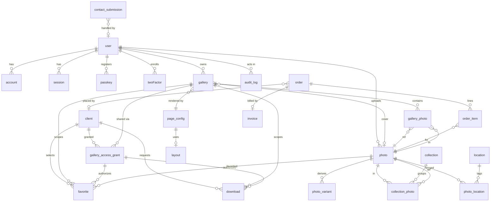

# Data Model

> **Status:** living data-model reference. This began as the Phase 0 plan and now tracks
> the implemented schema at a practical/documentation level.
>
> **Schema source of truth:** [Drizzle ORM](https://orm.drizzle.team) schema definitions
> (`src/db/schema/*.ts`) are the single source of truth. All migrations are generated and
> applied via `drizzle-kit`. This document describes intent; the Drizzle schema is canonical.
>
> **Better Auth ownership:** [Better Auth](https://www.better-auth.com) manages its **own**
> tables (`user`, `account`, `session`, `verification`, plus plugin tables for TOTP/2FA,
> passkeys/WebAuthn, and rate-limit state). We do **not** hand-write or re-implement these.
> Application tables reference Better Auth's `user.id` by foreign key. Where this document
> describes auth tables, it is documenting the _shape Better Auth provides_ so the rest of the
> model is coherent — those sections are reference, not our migrations.

---

## 1. Entity-Relationship Overview



---

## 2. Conventions

- **Primary keys:** `id` is `text` storing a ULID/UUIDv7 (sortable, opaque, safe to expose in
  client-facing URLs where appropriate). Better Auth tables use Better Auth's own `id` format.
- **Timestamps:** `created_at` / `updated_at` are `timestamptz NOT NULL DEFAULT now()`.
  Soft deletes use `deleted_at timestamptz NULL` where noted.
- **Money:** stored as integer minor units (`cents`) with an explicit `currency` (ISO 4217),
  never floats. Applies only to the deferred store tables.
- **Enums:** implemented as Postgres `text` columns with Drizzle-level enum + `CHECK`
  constraints (avoids painful native-enum migrations).
- **JSON:** `jsonb` for structured config (page configs, EXIF subset, metadata).
- **Storage keys:** opaque strings resolved by the `StorageProvider` (SeaweedFS/S3-compatible
  default, filesystem alternate). The DB never stores absolute filesystem paths or signed URLs — only keys.

---

## 3. Auth & Identity (Better Auth–owned — reference)

> These tables are **created and migrated by Better Auth**, not by our Drizzle migrations.
> Documented here so foreign keys elsewhere are unambiguous. Exact column names follow
> Better Auth's schema; the `role` field is added via Better Auth's `additionalFields`.

### 3.1 `user`

| Field          | Type        | Constraints                | Notes                                           |
| -------------- | ----------- | -------------------------- | ----------------------------------------------- |
| id             | text        | PK                         | Better Auth id                                  |
| name           | text        | NOT NULL                   |                                                 |
| email          | text        | NOT NULL, UNIQUE           | login identity                                  |
| email_verified | boolean     | NOT NULL DEFAULT false     |                                                 |
| image          | text        | NULL                       | avatar storage key/url                          |
| role           | text        | NOT NULL DEFAULT `'staff'` | `owner` \| `admin` \| `staff` (additionalField) |
| created_at     | timestamptz | NOT NULL                   |                                                 |
| updated_at     | timestamptz | NOT NULL                   |                                                 |

**Roles:**

- `owner` — single super-user; can manage other admins, billing config, destructive ops.
- `admin` — full content + gallery + client management.
- `staff` — upload + media library + limited gallery edits; no user/role management.

Index: `UNIQUE(email)` (Better Auth provides).

### 3.2 `account` (Better Auth)

Holds credential/provider records (password hash for the credential provider, OAuth links if
ever added). One user → many accounts. FK `user_id → user.id ON DELETE CASCADE`.
Password hashing, rotation, and verification are entirely Better Auth's responsibility.

### 3.3 `session` (Better Auth)

| Field                   | Type              | Notes         |
| ----------------------- | ----------------- | ------------- |
| id                      | text PK           |               |
| user_id                 | text FK → user.id | CASCADE       |
| token                   | text UNIQUE       | session token |
| expires_at              | timestamptz       |               |
| ip_address              | text              |               |
| user_agent              | text              |               |
| created_at / updated_at | timestamptz       |               |

### 3.4 `verification` (Better Auth)

Email verification + password-reset tokens. Fields: `id`, `identifier`, `value`, `expires_at`.

### 3.5 `twoFactor` / TOTP (Better Auth 2FA plugin)

Stores per-user TOTP secret (encrypted by Better Auth) + backup codes. FK to `user`.
Enrollment is optional per admin; `owner` SHOULD be required to enroll by policy.

### 3.6 `passkey` (Better Auth WebAuthn/passkey plugin)

| Field                   | Type              | Notes                  |
| ----------------------- | ----------------- | ---------------------- |
| id                      | text PK           |                        |
| user_id                 | text FK → user.id | CASCADE                |
| credential_id           | text UNIQUE       | WebAuthn credential id |
| public_key              | text              |                        |
| counter                 | bigint            | signature counter      |
| device_type / backed_up | text/boolean      |                        |
| transports              | text              |                        |
| created_at              | timestamptz       |                        |

### 3.7 Rate-limit / lockout state (Better Auth)

Better Auth's rate-limiter persists attempt counters and lockout windows (in Redis when the
secondary storage adapter is configured — **our deployment routes Better Auth rate-limit +
session secondary storage to Redis**). Failed-login lockout thresholds are configured in
Better Auth options. No app-owned table required; see API-DESIGN §rate-limit for policy.

---

## 4. Clients (gallery recipients — lightweight)

Clients are **not** admin users and do **not** authenticate against Better Auth. They are
lightweight records that receive galleries via access grants/share links. A client may exist
with only a name + email (e.g. created when sending a gallery).

### 4.1 `client`

| Field                   | Type        | Constraints        | Notes                    |
| ----------------------- | ----------- | ------------------ | ------------------------ |
| id                      | text        | PK                 |                          |
| name                    | text        | NULL               | display name             |
| email                   | text        | NOT NULL           | contact / share delivery |
| phone                   | text        | NULL               |                          |
| notes                   | text        | NULL               | internal admin notes     |
| created_by              | text        | FK → user.id, NULL | admin who created        |
| created_at / updated_at | timestamptz | NOT NULL           |                          |
| deleted_at              | timestamptz | NULL               | soft delete              |

Indexes:

- `UNIQUE(lower(email))` — partial `WHERE deleted_at IS NULL` (one active client per email).
- `INDEX(created_by)`.

---

## 5. Galleries

### 5.1 `gallery`

| Field                   | Type        | Constraints                  | Notes                                |
| ----------------------- | ----------- | ---------------------------- | ------------------------------------ |
| id                      | text        | PK                           |                                      |
| slug                    | text        | NOT NULL, UNIQUE             | URL slug for public galleries        |
| title                   | text        | NOT NULL                     |                                      |
| description             | text        | NULL                         |                                      |
| visibility              | text        | NOT NULL DEFAULT `'private'` | `public` \| `private`                |
| status                  | text        | NOT NULL DEFAULT `'draft'`   | `draft` \| `published` \| `archived` |
| owner_id                | text        | FK → user.id, NOT NULL       | owning admin                         |
| cover_photo_id          | text        | FK → photo.id, NULL          | ON DELETE SET NULL                   |
| page_config_id          | text        | FK → page_config.id, NULL    | layout/theme for this gallery        |
| client_id               | text        | FK → client.id, NULL         | primary client (convenience)         |
| expires_at              | timestamptz | NULL                         | gallery-level expiry (private)       |
| password_hash           | text        | NULL                         | optional gallery-wide password       |
| download_enabled        | boolean     | NOT NULL DEFAULT false       | default download policy              |
| published_at            | timestamptz | NULL                         |                                      |
| created_at / updated_at | timestamptz | NOT NULL                     |                                      |
| deleted_at              | timestamptz | NULL                         | soft delete                          |

Indexes:

- `UNIQUE(slug)`.
- `INDEX(owner_id)`, `INDEX(client_id)`.
- Partial `INDEX(visibility, status) WHERE deleted_at IS NULL` for public listing.

---

## 6. Gallery Access Grants (expiring share links)

Each grant is a capability: a tokenized, optionally-expiring, optionally-password-protected
link binding a **client** to a **gallery** with a set of permissions. Multiple grants per
gallery are allowed (different clients, different permissions, revocable independently).

### 6.1 `gallery_access_grant`

| Field                   | Type        | Constraints               | Notes                                           |
| ----------------------- | ----------- | ------------------------- | ----------------------------------------------- |
| id                      | text        | PK                        |                                                 |
| gallery_id              | text        | FK → gallery.id, NOT NULL | CASCADE                                         |
| client_id               | text        | FK → client.id, NULL      | NULL = anyone-with-link                         |
| token_hash              | text        | NOT NULL, UNIQUE          | **hash** of share token; raw token never stored |
| label                   | text        | NULL                      | admin-facing label                              |
| can_view                | boolean     | NOT NULL DEFAULT true     |                                                 |
| can_favorite            | boolean     | NOT NULL DEFAULT true     |                                                 |
| can_download            | boolean     | NOT NULL DEFAULT false    |                                                 |
| password_hash           | text        | NULL                      | per-grant password (optional)                   |
| expires_at              | timestamptz | NULL                      | NULL = no expiry                                |
| revoked_at              | timestamptz | NULL                      | revocation                                      |
| last_accessed_at        | timestamptz | NULL                      | telemetry                                       |
| access_count            | integer     | NOT NULL DEFAULT 0        |                                                 |
| created_by              | text        | FK → user.id, NULL        |                                                 |
| created_at / updated_at | timestamptz | NOT NULL                  |                                                 |

**Token model:** the raw share token (high-entropy, e.g. 32-byte base64url) is shown once at
creation and embedded in the share URL. We store only `token_hash` (SHA-256). Lookups hash the
inbound token and match. A grant is **active** iff
`revoked_at IS NULL AND (expires_at IS NULL OR expires_at > now())`.

Indexes:

- `UNIQUE(token_hash)`.
- `INDEX(gallery_id)`, `INDEX(client_id)`.
- Partial `INDEX(gallery_id) WHERE revoked_at IS NULL` (active grants per gallery).

---

## 7. Photos & Variants

### 7.1 `photo`

| Field                   | Type        | Constraints                  | Notes                                      |
| ----------------------- | ----------- | ---------------------------- | ------------------------------------------ |
| id                      | text        | PK                           |                                            |
| owner_id                | text        | FK → user.id, NOT NULL       | uploader                                   |
| original_storage_key    | text        | NOT NULL                     | original preserved, never mutated          |
| filename                | text        | NOT NULL                     | original filename                          |
| mime_type               | text        | NOT NULL                     | source mime                                |
| byte_size               | bigint      | NOT NULL                     | original size                              |
| width                   | integer     | NOT NULL                     | original px                                |
| height                  | integer     | NOT NULL                     | original px                                |
| capture_date            | timestamptz | NULL                         | from EXIF, normalized to UTC               |
| dominant_color          | text        | NULL                         | hex, for placeholders/theming              |
| lqip                    | text        | NULL                         | base64 LQIP data URI (tiny)                |
| blurhash                | text        | NULL                         | blurhash string                            |
| alt_text                | text        | NULL                         | accessibility                              |
| exif                    | jsonb       | NULL                         | normalized EXIF subset (see below)         |
| processing_status       | text        | NOT NULL DEFAULT `'pending'` | `pending`\|`processing`\|`ready`\|`failed` |
| processing_error        | text        | NULL                         |                                            |
| created_at / updated_at | timestamptz | NOT NULL                     |                                            |
| deleted_at              | timestamptz | NULL                         | soft delete                                |

**Normalized EXIF subset (`exif` jsonb):** `{ make, model, lens, focalLength, fNumber,
exposureTime, iso, gps?: { lat, lng }, orientation, dateTimeOriginal }`. GPS may be stripped
on public photos by policy. Orientation is **applied** during processing so derivatives are
upright; the field records the source value.

Indexes:

- `INDEX(owner_id)`.
- `INDEX(processing_status)` (worker queries).
- `INDEX(capture_date)`.
- Partial `INDEX WHERE deleted_at IS NULL`.

### 7.2 `photo_variant`

Derivatives generated by the sharp pipeline. The original is **never** a variant.

| Field       | Type        | Constraints             | Notes                                         |
| ----------- | ----------- | ----------------------- | --------------------------------------------- |
| id          | text        | PK                      |                                               |
| photo_id    | text        | FK → photo.id, NOT NULL | CASCADE                                       |
| format      | text        | NOT NULL                | `avif` \| `webp` \| `jpeg`                    |
| size_bucket | text        | NOT NULL                | `thumb`\|`small`\|`medium`\|`large`\|`xlarge` |
| storage_key | text        | NOT NULL                |                                               |
| width       | integer     | NOT NULL                |                                               |
| height      | integer     | NOT NULL                |                                               |
| byte_size   | bigint      | NOT NULL                |                                               |
| created_at  | timestamptz | NOT NULL                |                                               |

Indexes:

- `UNIQUE(photo_id, format, size_bucket)` — one variant per (photo, format, bucket).
- `INDEX(photo_id)`.

---

## 8. Collections/Categories & Locations

Public portfolio is browsable **by Category** (collection) and **by Location**. Both are
many-to-many with photos and carry explicit ordering.

### 8.1 `collection` (category)

| Field                   | Type        | Constraints                   | Notes                                |
| ----------------------- | ----------- | ----------------------------- | ------------------------------------ |
| id                      | text        | PK                            |                                      |
| slug                    | text        | NOT NULL, UNIQUE              | e.g. `portraits`, `events`, `nature` |
| name                    | text        | NOT NULL                      |                                      |
| description             | text        | NULL                          |                                      |
| kind                    | text        | NOT NULL DEFAULT `'category'` | reserved for future grouping         |
| cover_photo_id          | text        | FK → photo.id, NULL           | SET NULL                             |
| sort_order              | integer     | NOT NULL DEFAULT 0            | among collections                    |
| is_published            | boolean     | NOT NULL DEFAULT true         |                                      |
| page_config_id          | text        | FK → page_config.id, NULL     |                                      |
| created_at / updated_at | timestamptz | NOT NULL                      |                                      |

### 8.2 `location`

| Field                   | Type        | Constraints           | Notes                                  |
| ----------------------- | ----------- | --------------------- | -------------------------------------- |
| id                      | text        | PK                    |                                        |
| slug                    | text        | NOT NULL, UNIQUE      | e.g. `arkansas`, `colorado`, `seattle` |
| name                    | text        | NOT NULL              |                                        |
| region                  | text        | NULL                  | state/country                          |
| lat / lng               | double      | NULL                  | map pin                                |
| cover_photo_id          | text        | FK → photo.id, NULL   | SET NULL                               |
| sort_order              | integer     | NOT NULL DEFAULT 0    |                                        |
| is_published            | boolean     | NOT NULL DEFAULT true |                                        |
| created_at / updated_at | timestamptz | NOT NULL              |                                        |

### 8.3 `collection_photo` (join, ordered)

| Field         | Type        | Constraints                           |
| ------------- | ----------- | ------------------------------------- |
| collection_id | text        | FK → collection.id, NOT NULL, CASCADE |
| photo_id      | text        | FK → photo.id, NOT NULL, CASCADE      |
| sort_order    | integer     | NOT NULL DEFAULT 0                    |
| created_at    | timestamptz | NOT NULL                              |

PK: `(collection_id, photo_id)`. Indexes: `INDEX(collection_id, sort_order)`, `INDEX(photo_id)`.

### 8.4 `photo_location` (join)

| Field       | Type    | Constraints                         |
| ----------- | ------- | ----------------------------------- |
| location_id | text    | FK → location.id, NOT NULL, CASCADE |
| photo_id    | text    | FK → photo.id, NOT NULL, CASCADE    |
| sort_order  | integer | NOT NULL DEFAULT 0                  |

PK: `(location_id, photo_id)`. Indexes: `INDEX(location_id, sort_order)`, `INDEX(photo_id)`.

---

## 9. Gallery ↔ Photo membership

### 9.1 `gallery_photo` (join, ordered)

| Field      | Type        | Constraints                        |
| ---------- | ----------- | ---------------------------------- |
| gallery_id | text        | FK → gallery.id, NOT NULL, CASCADE |
| photo_id   | text        | FK → photo.id, NOT NULL, CASCADE   |
| sort_order | integer     | NOT NULL DEFAULT 0                 |
| added_at   | timestamptz | NOT NULL DEFAULT now()             |

PK: `(gallery_id, photo_id)`.
Indexes: `INDEX(gallery_id, sort_order)` (primary render order), `INDEX(photo_id)`.

---

## 10. Favorites (client-scoped within a gallery)

A favorite is scoped to a **grant** (which client, which gallery), so revoking a grant cleanly
isolates selections. We store both `grant_id` and denormalized `gallery_id`/`client_id` for
query convenience.

### 10.1 `favorite`

| Field      | Type        | Constraints                            | Notes                     |
| ---------- | ----------- | -------------------------------------- | ------------------------- |
| id         | text        | PK                                     |                           |
| grant_id   | text        | FK → gallery_access_grant.id, NOT NULL | CASCADE                   |
| gallery_id | text        | FK → gallery.id, NOT NULL              | CASCADE                   |
| client_id  | text        | FK → client.id, NULL                   | NULL for anon-link grants |
| photo_id   | text        | FK → photo.id, NOT NULL                | CASCADE                   |
| created_at | timestamptz | NOT NULL                               |                           |

Indexes:

- `UNIQUE(grant_id, photo_id)` — one favorite per photo per grant.
- `INDEX(gallery_id)`, `INDEX(photo_id)`.

---

## 11. Downloads (log)

Records every download request (single photo or zip) for auditing, quotas, and rate limiting.

### 11.1 `download`

| Field              | Type        | Constraints                        | Notes                                                 |
| ------------------ | ----------- | ---------------------------------- | ----------------------------------------------------- |
| id                 | text        | PK                                 |                                                       |
| grant_id           | text        | FK → gallery_access_grant.id, NULL | NULL for admin/public                                 |
| gallery_id         | text        | FK → gallery.id, NULL              |                                                       |
| client_id          | text        | FK → client.id, NULL               |                                                       |
| photo_id           | text        | FK → photo.id, NULL                | NULL for zip-of-many                                  |
| kind               | text        | NOT NULL                           | `single` \| `zip`                                     |
| variant            | text        | NULL                               | requested size/format for single                      |
| status             | text        | NOT NULL DEFAULT `'requested'`     | `requested`\|`building`\|`ready`\|`failed`\|`expired` |
| job_id             | text        | NULL                               | BullMQ job id for zip builds                          |
| result_storage_key | text        | NULL                               | built zip artifact key                                |
| byte_size          | bigint      | NULL                               |                                                       |
| ip_address         | text        | NULL                               |                                                       |
| user_agent         | text        | NULL                               |                                                       |
| expires_at         | timestamptz | NULL                               | zip artifact expiry                                   |
| created_at         | timestamptz | NOT NULL                           |                                                       |

Indexes: `INDEX(grant_id)`, `INDEX(gallery_id)`, `INDEX(status)`, `INDEX(created_at)`.

---

## 12. Page Configs & Layouts (data-driven rendering)

Admins choose page layouts via the admin UI; the chosen configuration is persisted and drives
rendering. `layout` is a small catalog of layout _types_; `page_config` is the per-surface
instance (home, gallery, category, location, about).

### 12.1 `layout`

| Field                   | Type        | Constraints      | Notes                                      |
| ----------------------- | ----------- | ---------------- | ------------------------------------------ |
| id                      | text        | PK               |                                            |
| key                     | text        | NOT NULL, UNIQUE | legacy catalog key; new gallery types are stored directly on `page_config.grid_type` |
| name                    | text        | NOT NULL         |                                            |
| schema                  | jsonb       | NULL             | JSON schema describing allowed config keys |
| created_at / updated_at | timestamptz | NOT NULL         |                                            |

### 12.2 `page_config`

| Field                   | Type        | Constraints             | Notes                                                          |
| ----------------------- | ----------- | ----------------------- | -------------------------------------------------------------- |
| id                      | text        | PK                      |                                                                |
| scope                   | text        | NOT NULL                | `home`\|`gallery`\|`category`\|`location`\|`about`\|`global`   |
| layout_id               | text        | FK → layout.id, NULL    | chosen layout type                                             |
| grid_type               | text        | NULL                    | free-form text; current UI/API allow masonry, justified, uniform, horizontal-lenis, parallax-ring, image-trail, rotating-scroll, diagonal-slideshow, depth-gallery, infinite-canvas, css-glitch, palmer-draggable, Tora layouts, carousel-3d-scroll, and alternative-scroll |
| spacing                 | text        | NULL                    | `tight`\|`normal`\|`airy` or layout-specific string             |
| theme                   | text        | NULL                    | `light`\|`dark`\|`auto` default                                |
| hero                    | jsonb       | NULL                    | hero config: `{ enabled, photoId, headline, height, overlay }` |
| config                  | jsonb       | NOT NULL DEFAULT `'{}'` | full per-page JSON (columns, gutters, ordering, etc.)          |
| is_default              | boolean     | NOT NULL DEFAULT false  | default for the scope                                          |
| created_at / updated_at | timestamptz | NOT NULL                |                                                                |

Indexes: `INDEX(scope)`; partial `UNIQUE(scope) WHERE is_default` (one default per scope).

### 12.3 `site_settings`

Singleton row (`id='site'`) for runtime-editable settings. Secrets are encrypted with
`SETTINGS_ENCRYPTION_KEY` before storage and are never returned to the client in plaintext.

Key groups:

- Branding/locale: `site_title`, `tagline`, `description`, `locale`, `timezone`,
  `date_format`, `week_starts_on`, `icon_storage_key`, `logo_storage_key`.
- Email: `email_driver`, `email_from`, SMTP fields, encrypted SMTP password, encrypted
  Resend API key.
- Store checkout/payments: checkout copy, tax/shipping/promo settings, Stripe readiness
  fields, encrypted Stripe secret/webhook values, statement descriptor.
- Integrations: encrypted Instagram token.
- Security & Spam: `captcha_enabled` for Turnstile login gating, plus
  `security_config` JSON (`contactSpamThreshold`, `contactBlockHighRisk`, blocked IPs,
  blocked countries, blocked email domains, blocked keywords).

**Example `config` (jsonb):**

```json
{
  "grid": {
    "type": "masonry",
    "columns": { "base": 1, "md": 2, "xl": 3 },
    "gutter": 12
  },
  "spacing": "normal",
  "theme": "auto",
  "hero": {
    "enabled": true,
    "photoId": "01J...",
    "headline": "Wild Places",
    "height": "70vh",
    "overlay": 0.3
  },
  "ordering": "manual",
  "showCaptions": false
}
```

---

## 13. Store (light catalog + optional hosted checkout)

> Product catalog, public browse/cart, manual invoice order requests, issued invoices,
> manual payment receipts, customer order-status lookup, refund tracking, fulfillment tracking,
> tax CSV export, and optional Stripe Checkout/Stripe Tax are active. Hosted checkout is enabled
> only when Settings -> Payments has all required Stripe values.

### 13.1 `product`

`id` PK, `slug` UNIQUE, `sku` UNIQUE, `name`, `description`, `kind`
(`print`\|`digital`\|`bundle`), `photo_id` FK→photo NULL, `base_price_cents`,
`sale_price_cents` NULL, `currency`, `category` NULL, `stripe_tax_code` NULL,
`inventory_tracked`, `stock_quantity`, `low_stock_threshold`, `allow_backorder`, JSON `tags`,
JSON `options`, `is_featured`, `is_active`, `sort_order`, timestamps.

`options` stores reusable product choice groups such as size, finish, license, or framing:
`[{ id, name, required, values: [{ id, label, priceDeltaCents, inventoryTracked,
stockQuantity, lowStockThreshold, allowBackorder }] }]`.

Product-level stock blocks checkout when `inventory_tracked=true`, `stock_quantity <= 0`, and
`allow_backorder=false`. Option-choice stock works the same way for selected values. Paid order
transitions decrement tracked product stock and selected tracked option values once; already-paid
orders/webhooks do not decrement again.

### 13.2 `order`

| Field                        | Type                     | Notes                                                                      |
| ---------------------------- | ------------------------ | -------------------------------------------------------------------------- |
| id                           | text PK                  |                                                                            |
| client_id                    | text FK → client.id NULL | placed by                                                                  |
| email                        | text                     | guest email                                                                |
| status                       | text                     | `draft`\|`pending`\|`invoiced`\|`paid`\|`fulfilled`\|`cancelled`           |
| subtotal_cents / total_cents | integer                  | product subtotal and final customer total                                  |
| discount_cents               | integer                  | promo discount snapshot; default 0                                         |
| promo_code                   | text NULL                | normalized applied code snapshot                                           |
| tax_cents / shipping_cents   | integer                  | saved checkout adjustments                                                 |
| shipping_profile_id          | text NULL                | selected shipping profile id at checkout                                   |
| shipping_profile_label       | text NULL                | selected shipping label at checkout                                        |
| currency                     | text                     |                                                                            |
| payment_provider             | text NULL                | `'manual'` or `'stripe'`                                                   |
| payment_ref                  | text NULL                | manual note, Stripe session id, or external ref                            |
| fulfillment_status           | text                     | `unfulfilled`\|`in_progress`\|`ready`\|`shipped`\|`delivered`\|`cancelled` |
| fulfillment_carrier          | text NULL                | client-facing carrier/pickup method                                        |
| fulfillment_tracking_number  | text NULL                | client-facing tracking or handoff reference                                |
| fulfillment_tracking_url     | text NULL                | optional tracking link                                                     |
| fulfillment_ready_at         | timestamptz NULL         | auto-filled when marked ready/shipped/delivered                            |
| fulfillment_shipped_at       | timestamptz NULL         | auto-filled when marked shipped/delivered                                  |
| fulfillment_delivered_at     | timestamptz NULL         | auto-filled when marked delivered                                          |
| fulfillment_notes            | text NULL                | internal admin notes; never shown on public receipts                       |
| store_settings_snapshot      | jsonb                    | saved checkout copy/tax/shipping settings                                  |
| created_at / updated_at      | timestamptz              |                                                                            |

Customer order-status pages do not add a table. They render a sanitized DTO from `order`,
`order_item`, `invoice`, and `order_refund`, either through a signed HMAC order-status token
or through a lookup that requires the checkout email plus order id / invoice number. Private
admin fulfillment notes and raw provider IDs stay admin-only.

### 13.3 `order_item`

`id` PK, `order_id` FK→order CASCADE, `product_id` FK→product NULL, `photo_id` FK→photo NULL,
`description`, `stripe_tax_code` NULL, JSON `options`, `quantity` integer,
`unit_price_cents` integer, `line_total_cents` integer.

`options` and `stripe_tax_code` snapshot selected product options/tax category at checkout so
later product edits do not rewrite historical order requests or tax exports.

### 13.4 `invoice`

`id` PK, `order_id` FK→order UNIQUE, `number` text UNIQUE, `status`
(`draft`\|`issued`\|`paid`\|`void`), `amount_cents`, `currency`, `notes`,
`payment_instructions`, `public_token_hash`, `issued_at`, `sent_at`, `due_at`, manual receipt
fields (`paid_at`, `paid_amount_cents`, `payment_method`, `payment_reference`,
`payment_note`, `receipt_sent_at`), hosted-payment fields
(`online_payment_provider`, `online_payment_tax_mode`, `online_payment_status`, `online_payment_session_id`,
`online_payment_intent_id`, `online_payment_url`, `online_payment_expires_at`),
`pdf_storage_key`, timestamps.

### 13.5 `order_refund`

Durable refund records for manual/provider refunds. Multiple rows per order are allowed so
partial refunds remain auditable.

| Field                 | Type                   | Notes                                              |
| --------------------- | ---------------------- | -------------------------------------------------- |
| id                    | text PK                |                                                    |
| order_id              | text FK → order        | CASCADE                                            |
| invoice_id            | text FK → invoice NULL | SET NULL                                           |
| amount_cents          | integer                | positive refund amount                             |
| currency              | text                   | copied from invoice/order                          |
| status                | text                   | `pending`\|`succeeded`\|`failed`\|`cancelled`      |
| provider              | text                   | `manual` or `stripe`; default `manual`             |
| provider_refund_id    | text NULL              | external refund id/reference                       |
| provider_error        | text NULL              | provider failure/status detail for failed attempts |
| method                | text NULL              | check, cash, Stripe dashboard, etc.                |
| reference             | text NULL              | check number / transaction id                      |
| reason                | text NULL              | customer-facing reason                             |
| note                  | text NULL              | customer-facing note shown on receipts/emails      |
| refunded_at           | timestamptz NULL       | effective refund date                              |
| receipt_sent_at       | timestamptz NULL       | when refund email was sent                         |
| created_by            | text FK → user.id NULL | admin who recorded it                              |
| created_at/updated_at | timestamptz            |                                                    |

Indexes: `INDEX(order_id)`, `INDEX(invoice_id)`.

### 13.6 Store payment settings (`site_settings`)

Store checkout settings live on the singleton `site_settings` row. Hosted payment readiness
adds:

`store_shipping_profiles` is JSON for customer-selectable shipping options:
`[{ id, label, mode: "manual"|"free"|"flat"|"pickup", amountCents, freeThresholdCents,
enabled }]`. If no active profile exists, the legacy `store_shipping_mode` /
`store_shipping_flat_cents` settings are used as a fallback.

`store_promo_codes` is JSON for store-wide cart discounts:
`[{ id, code, label, active, discountType: "percent"|"fixed", amountCents, percentBps,
minimumSubtotalCents, usageLimit, expiresAt }]`. Codes are normalized uppercase and applied
before tax and shipping. Usage limits count orders whose `promo_code` matches the code.

| Field                          | Type      | Notes                                                                  |
| ------------------------------ | --------- | ---------------------------------------------------------------------- |
| store_online_payments_enabled  | boolean   | permits hosted checkout only when provider + Stripe fields are ready   |
| store_payment_provider         | text      | `manual`\|`stripe`; default `manual`                                   |
| store_payment_mode             | text      | `test`\|`live`; default `test`                                         |
| store_stripe_tax_enabled       | boolean   | optional Stripe Tax for hosted checkout                                |
| store_invoice_tax_mode         | text      | `fixed`\|`stripe`; defaults fixed for invoice payment links            |
| store_stripe_shipping_tax_code | text NULL | optional Stripe Tax category for the app's flat shipping line          |
| stripe_publishable_key         | text NULL | non-secret Stripe key                                                  |
| stripe_secret_key_enc          | text NULL | encrypted with `SETTINGS_ENCRYPTION_KEY`                               |
| stripe_webhook_secret_enc      | text NULL | encrypted with `SETTINGS_ENCRYPTION_KEY`; required for hosted checkout |
| stripe_statement_descriptor    | text NULL | optional Stripe statement descriptor                                   |

### 13.7 `stripe_webhook_event`

Stores Stripe event IDs for webhook idempotency and operator audit:

| Field                 | Type        | Notes                                          |
| --------------------- | ----------- | ---------------------------------------------- |
| id                    | text PK     | Stripe event id, e.g. `evt_...`                |
| type                  | text        | Stripe event type                              |
| livemode              | boolean     | copied from Stripe                             |
| api_version           | text NULL   | copied from Stripe                             |
| invoice_id            | text FK     | nullable link to `invoice`                     |
| session_id            | text NULL   | Checkout session id                            |
| payment_intent_id     | text NULL   | Stripe PaymentIntent id                        |
| status                | text        | `processing`\|`processed`\|`ignored`\|`failed` |
| error                 | text NULL   | last processing error, if any                  |
| received_at           | timestamptz | when the event first reached the app           |
| processed_at          | timestamptz | when processing/ignore/failure was recorded    |
| created_at/updated_at | timestamptz | standard timestamps                            |

---

## 14. Audit Log

### 14.1 `audit_log`

| Field       | Type        | Constraints               | Notes                                                  |
| ----------- | ----------- | ------------------------- | ------------------------------------------------------ |
| id          | text        | PK                        |                                                        |
| actor_id    | text        | FK → user.id, NULL        | NULL = system/anon                                     |
| actor_type  | text        | NOT NULL DEFAULT `'user'` | `user`\|`client`\|`system`                             |
| action      | text        | NOT NULL                  | e.g. `gallery.publish`, `grant.revoke`, `photo.delete` |
| entity_type | text        | NOT NULL                  | `gallery`\|`photo`\|`grant`\|`client`\|...             |
| entity_id   | text        | NULL                      |                                                        |
| ip_address  | text        | NULL                      |                                                        |
| user_agent  | text        | NULL                      |                                                        |
| metadata    | jsonb       | NULL                      | before/after diff or context                           |
| created_at  | timestamptz | NOT NULL                  |                                                        |

Indexes: `INDEX(actor_id)`, `INDEX(entity_type, entity_id)`, `INDEX(action)`, `INDEX(created_at)`.
This table is **append-only**; no updates/deletes outside retention pruning.

---

## 15. Contact / Email Submissions

### 15.1 `contact_submission`

| Field                   | Type        | Constraints                  | Notes                                              |
| ----------------------- | ----------- | ---------------------------- | -------------------------------------------------- |
| id                      | text        | PK                           |                                                    |
| name                    | text        | NOT NULL                     |                                                    |
| email                   | text        | NOT NULL                     |                                                    |
| phone                   | text        | NULL                         |                                                    |
| subject                 | text        | NULL                         |                                                    |
| message                 | text        | NOT NULL                     |                                                    |
| spam_score              | real        | NULL                         | 0.0–1.0 from spam check                            |
| spam_verdict            | text        | NOT NULL DEFAULT `'unknown'` | `ham`\|`spam`\|`unknown`                           |
| spam_signals            | jsonb       | NULL                         | `{ honeypot, captcha, heuristics, providerScore }` |
| status                  | text        | NOT NULL DEFAULT `'new'`     | `new`\|`read`\|`replied`\|`archived`\|`spam`       |
| ip_address              | text        | NULL                         |                                                    |
| user_agent              | text        | NULL                         |                                                    |
| handled_by              | text        | FK → user.id, NULL           | admin who actioned                                 |
| created_at / updated_at | timestamptz | NOT NULL                     |                                                    |

**Spam protection:** honeypot field + timing heuristic + optional CAPTCHA/Turnstile + provider
score; combined into `spam_score`/`spam_verdict`. High-score submissions are stored (status
`spam`) but not emailed to the admin. See API-DESIGN §rate-limit.

Indexes: `INDEX(status)`, `INDEX(created_at)`, `INDEX(spam_verdict)`.

---

## 16. Security & Traffic Events

### 16.1 `security_event`

Event rows that power the admin **Security & Spam** dashboard. This table is an operator
visibility surface, not an authorization source of truth.

| Field      | Type        | Constraints                 | Notes                                              |
| ---------- | ----------- | --------------------------- | -------------------------------------------------- |
| id         | text        | PK                          |                                                    |
| surface    | text        | NOT NULL                    | `contact`\|`login`\|`traffic`                      |
| action     | text        | NOT NULL                    | e.g. `login.failed`, `contact.submitted`           |
| outcome    | text        | NOT NULL DEFAULT `unknown`  | `allowed`\|`blocked`\|`spam`\|`failed`\|`success`\|`unknown` |
| ip_address | text        | NULL                        | Derived from request headers; see `src/lib/request.ts` |
| country    | text        | NULL                        | Cloudflare/Vercel country header when present      |
| user_agent | text        | NULL                        | Raw user agent                                     |
| browser    | text        | NULL                        | Parsed browser family                              |
| os         | text        | NULL                        | Parsed OS family                                   |
| device     | text        | NULL                        | Parsed device class                                |
| referrer   | text        | NULL                        | Normalized referrer                                |
| source     | text        | NULL                        | Traffic source such as `google`, `instagram`, `direct` |
| path       | text        | NULL                        | Request path                                       |
| email      | text        | NULL                        | Normalized email where relevant                    |
| metadata   | jsonb       | NULL                        | Context-specific summary                           |
| created_at | timestamptz | NOT NULL                    |                                                    |

Indexes: `INDEX(created_at)`, `INDEX(surface, outcome)`, `INDEX(ip_address)`,
`INDEX(source)`.

---

## 17. Indexing & Performance Strategy

**Foreign keys.** Every FK column is indexed (Postgres does **not** auto-index the referencing
side). FK delete behavior: `CASCADE` for owned children (variants, join rows, favorites,
grants, order items); `SET NULL` for soft references (cover photos, handled_by).

**Composite indexes for ordered reads.** The hot path is "list photos of a gallery/collection/
location in display order." Backed by:

- `gallery_photo(gallery_id, sort_order)`
- `collection_photo(collection_id, sort_order)`
- `photo_location(location_id, sort_order)`
  These serve both the index-scan and the order-by, avoiding sorts.

**Cursor pagination support.** Media lists paginate by a stable composite cursor
`(sort_order, photo_id)` (or `(created_at, id)` for admin library). The composite indexes above
make keyset pagination index-only-ish and fast. See API-DESIGN §pagination for justification.

**Partial indexes for active rows.**

- `gallery_access_grant(gallery_id) WHERE revoked_at IS NULL` — active grants only.
- `gallery(visibility, status) WHERE deleted_at IS NULL` — public listing.
- `page_config(scope) WHERE is_default` — single default per scope (unique).
- Photo/gallery/client list indexes filtered `WHERE deleted_at IS NULL`.

**Token lookup.** `gallery_access_grant.token_hash` is `UNIQUE` and the sole lookup path for
share-link auth — single index probe, constant time, no scanning.

**Worker queries.** `photo(processing_status)` indexed so the pipeline can find pending/failed
work cheaply. `download(status)` indexed for zip-build polling/cleanup.

**JSONB.** `config`/`exif`/`metadata` are queried rarely and read whole; no GIN indexes in
Phase 0. Add GIN only if/when JSON-path filtering becomes a real query pattern.

**Audit/log volume.** `audit_log` and `download` grow unbounded; both are append-only with
`created_at` indexes to support time-range retention pruning (scheduled job, future).

**Uniqueness for idempotency.** `photo_variant(photo_id, format, size_bucket)` UNIQUE makes
pipeline re-runs idempotent (upsert). `favorite(grant_id, photo_id)` UNIQUE makes
favorite-toggling idempotent.

---

## 17. Open Questions / Deferred

- Multi-photographer tenancy: model assumes a single studio (owner + staff). Multi-tenant
  isolation is out of scope for Phase 0.
- Tagging/keywords beyond category/location (free-form tags) — deferred.
- Watermarking policy + per-gallery download size caps — interface exists (`download_enabled`,
  variant selection); enforcement detail deferred.
- Store tax/VAT compliance operations — registrations/nexus decisions and filing/reporting
  remain deferred.
