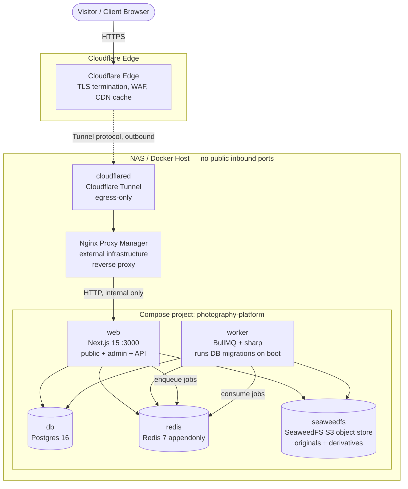

# DEPLOYMENT

> **Final deployment guide + run-book** for the self-hosted photography platform. This reflects the implemented Compose stack under `docker/`, the real env set in `.env.example`, and the operational scripts in `scripts/`. All commands are run from the repo root.

The application is a single **Next.js 15 (App Router, TypeScript)** process (`web`, `:3000`, standalone output) plus a **separate BullMQ worker** (`worker`) sharing the same codebase. Backing services are **PostgreSQL 16**, **Redis 7**, and **SeaweedFS** (S3-compatible object store — the default media backend; replaced MinIO per ADR-0024). Everything runs on a **NAS** under Docker. **Nginx Proxy Manager (NPM)** and **Cloudflare Tunnel (`cloudflared`)** front the stack; the tunnel is **egress-only**, so the NAS opens **no public inbound ports**.

---

## 1. Overview & Topology



**Trust boundary & key facts:**

- Cloudflare terminates TLS and provides WAF/CDN. `cloudflared` makes an **outbound-only** connection to Cloudflare — nothing on the NAS listens on a public port; no router port-forwarding.
- **NPM is external infrastructure** (it runs outside this Compose project, or `cloudflared` can point straight at `web`). The tunnel's public hostname maps to either NPM or directly to `http://web:3000`.
- **Only `web` is proxied to.** `db`, `redis`, `seaweedfs`, and `worker` are reachable on the internal bridge network only.

---

## 2. Services

Defined in `docker/compose.yaml` (base), with `docker/compose.prod.yaml` (prod overlay: log rotation, resource limits, optional tunnel) and `docker/compose.dev.yaml` (dev overlay: publishes `db`/`redis` to the host for host-run tooling).

| Service | Image / Build | Purpose | Ports | Volumes | Healthcheck | Restart |
| --- | --- | --- | --- | --- | --- | --- |
| `web` | build `docker/Dockerfile.web` (Next.js standalone, node:22) | Public site + admin/CMS + API | `${WEB_PORT:-3000}:3000` (for NPM) | none (stateless) | `GET /api/health` (node fetch) | `unless-stopped` |
| `worker` | build `docker/Dockerfile.worker` (tsx, node:22) | BullMQ image + email queues; **runs DB migrations on boot** | none (internal `:9091` health only) | none (stateless) | `GET :9091/health` | `unless-stopped` |
| `db` | `postgres:16-alpine` | System of record (users, galleries, grants, media metadata) | internal only | `pgdata` | `pg_isready -U $POSTGRES_USER -d $POSTGRES_DB` | `unless-stopped` |
| `redis` | `redis:7-alpine` (`--appendonly yes`) | BullMQ broker + sessions + rate limiting | internal only | `redisdata` | `redis-cli ping` | `unless-stopped` |
| `seaweedfs` | `chrislusf/seaweedfs:latest` | Default S3 media store (originals + derivatives); all-in-one `server -s3` (master + volume + filer + S3 gateway in one process) | **none published** (internal network only; debug ports commented out in `docker/compose.yaml`) | `seaweeddata` | `GET :9333/cluster/status` (master) | `unless-stopped` |
| `seaweedfs-init` | `minio/mc:latest` | **One-shot**: retries until the S3 gateway is up, then creates the `${S3_BUCKET}` bucket and exits | — | none | — | runs once |
| `cloudflared` | `cloudflare/cloudflared:latest` | **Optional** Cloudflare Tunnel (prod overlay, `tunnel` profile) | none (egress-only) | none | — | `unless-stopped` |

**Notes:**

- `web` and `worker` both `depends_on` `db`, `redis`, and `seaweedfs` with `condition: service_healthy` (plus `seaweedfs-init` with `condition: service_completed_successfully`), so they only start once backing services report healthy and the bucket exists (avoids migration/connection races).
- SeaweedFS reads its S3 identities/credentials from `docker/seaweedfs/s3.json` (mounted read-only), **not** from env vars — there are no `MINIO_ROOT_USER`/`MINIO_ROOT_PASSWORD`. The keys in that file **must match** `S3_ACCESS_KEY_ID`/`S3_SECRET_ACCESS_KEY` in `.env`.
- The `worker` Docker image now copies `scripts/`, so first-deploy seeding via `docker compose run --rm worker npm run db:seed` works.
- `worker` runs **two BullMQ workers** (image pipeline + email), each at **concurrency 4** (`worker/index.ts`).
- On boot the worker applies Drizzle migrations from `src/db/migrations` (gated by `RUN_MIGRATIONS`, default `true`), so `docker compose up` is self-contained.
- The prod overlay adds JSON-file log rotation (10 MB × 3) and resource limits: `web` 1.5 CPU / 1 GB, `worker` 2 CPU / 2 GB.
- `cloudflared` is gated behind the `tunnel` profile and only starts with `--profile tunnel` + a `TUNNEL_TOKEN`. If you run NPM/cloudflared externally, leave the profile off.

---

## 3. Volumes & Persistence

| Volume | Backs | NAS mapping (example) | Tier |
| --- | --- | --- | --- |
| `pgdata` | Postgres 16 data directory | `/volume1/docker/photo/pg` | **Critical** — system of record |
| `seaweeddata` | SeaweedFS objects — **originals + derivatives** | `/volume1/photos/seaweedfs` | **Critical (originals)**; derivatives regenerable |
| `redisdata` | Redis appendonly (AOF) file | `/volume1/docker/photo/redis` | Important — protects in-flight queue jobs |

- **`pgdata`** — must persist; never a tmpfs/throwaway volume.
- **`seaweeddata`** — the irreplaceable asset. Holds source **originals** (cannot be recreated) and **derivatives** (thumbnails/resized/LQIP, regenerable by re-running the sharp pipeline). Map this to durable NAS storage.
- **`redisdata`** — `redis` runs with `--appendonly yes` so queued media-processing/email jobs survive a restart. Cache misses after restart are harmless.

To map a named volume to a NAS path, override it with a bind mount or a `local`-driver volume in your overlay; the defaults are Docker-managed named volumes.

---

## 4. Environment

All config is supplied via environment variables. Copy the committed template and fill in real values:

```bash
cp .env.example .env
```

`.env` is git-ignored and read by **both** `web` and `worker`. `src/lib/env.ts` parses and validates it with Zod. Variable **groups** (names only — see `.env.example` for the full list):

- **App** — `NODE_ENV`, `WEB_PORT` (host port; container always listens on `3000`), `APP_BASE_URL`, `NEXT_PUBLIC_APP_URL`.
- **Database** — `DATABASE_URL`, and the values the `db` container itself uses: `POSTGRES_USER`, `POSTGRES_PASSWORD`, `POSTGRES_DB`.
- **Redis** — `REDIS_URL`.
- **Auth (Better Auth)** — `BETTER_AUTH_SECRET`, `BETTER_AUTH_URL`.
- **Settings encryption** — `SETTINGS_ENCRYPTION_KEY` (64 hex chars / 32 bytes; `openssl rand -hex 32`). Encrypts editable secrets stored in the DB by the **Settings** tab (the SMTP password / Resend key). **Optional** — when unset, a key is derived from `BETTER_AUTH_SECRET` so dev boots; set a dedicated value in production. Rotating it invalidates stored secrets (re-enter them in the UI).
- **Storage (S3 / SeaweedFS)** — `STORAGE_DRIVER` (`minio` default — the generic S3 driver name, now pointed at SeaweedFS; `filesystem` alternate), `S3_ENDPOINT` (`http://seaweedfs:8333`), `S3_REGION`, `S3_ACCESS_KEY_ID`, `S3_SECRET_ACCESS_KEY`, `S3_BUCKET`, `S3_FORCE_PATH_STYLE=true`, and `STORAGE_FS_PATH` (filesystem driver only). **There are no `MINIO_ROOT_*` vars** — SeaweedFS reads its identities from `docker/seaweedfs/s3.json`, and `S3_ACCESS_KEY_ID`/`S3_SECRET_ACCESS_KEY` **must match** the keys in that file.
- **Email** — `EMAIL_DRIVER` (`log` default, `smtp`, `resend`), `EMAIL_FROM`, `CONTACT_NOTIFY_EMAIL`, `SMTP_HOST`/`SMTP_PORT`/`SMTP_USER`/`SMTP_PASSWORD`, `RESEND_API_KEY`. These are the **fallback**; the **Settings → Email** tab overrides them at runtime (SMTP/Resend config in `site_settings`, secret encrypted). "Send test email" verifies the live config.
- **Payments** — `PAYMENTS_DRIVER` (`stub`, deferred), `STRIPE_SECRET_KEY`.
- **Worker** — `WORKER_HEALTH_PORT` (default `9091`), `RUN_MIGRATIONS` (default `true`; set `false` to run migrations out-of-band).
- **Tunnel** — `TUNNEL_TOKEN` (only when using the `tunnel` profile; critical secret).
- **Seed** — `SEED_OWNER_EMAIL`, `SEED_OWNER_PASSWORD`.

> **Production fails closed on a weak auth secret.** `instrumentation.ts` runs on server boot and **throws / refuses to start** in production if `BETTER_AUTH_SECRET` is empty, equals a known default (`dev-insecure-secret-change-me`, `change-me-with-openssl-rand-base64-32`), or is shorter than 32 chars. Generate a strong value:
>
> ```bash
> openssl rand -base64 48
> ```
>
> Apply the same to `POSTGRES_PASSWORD`, the S3 credentials (`S3_ACCESS_KEY_ID` / `S3_SECRET_ACCESS_KEY` — keep these in sync with `docker/seaweedfs/s3.json`), and `SEED_OWNER_PASSWORD`. Real secrets live only in `.env`, never in git.

---

## 5. First Deploy (NAS)

```bash
# 1. Clone the repo onto the NAS, cd into it.
git clone <repo-url> photography-platform && cd photography-platform

# 2. Create and edit the env file. Set NODE_ENV=production, real DATABASE_URL,
#    a strong BETTER_AUTH_SECRET (openssl rand -base64 48), a dedicated
#    SETTINGS_ENCRYPTION_KEY (openssl rand -hex 32), S3 creds (and keep
#    them in sync with docker/seaweedfs/s3.json),
#    APP_BASE_URL / BETTER_AUTH_URL = your public Cloudflare hostname.
cp .env.example .env
$EDITOR .env
# 2b. Edit docker/seaweedfs/s3.json so its accessKey/secretKey match
#     S3_ACCESS_KEY_ID / S3_SECRET_ACCESS_KEY in .env.
$EDITOR docker/seaweedfs/s3.json

# 3. Build + start the production stack (base + prod overlay).
docker compose -f docker/compose.yaml -f docker/compose.prod.yaml --env-file .env up -d --build
```

On startup: `seaweedfs-init` waits for the S3 gateway and creates the `${S3_BUCKET}` bucket; the **worker applies all DB migrations automatically** (`RUN_MIGRATIONS=true`); `web` comes up once `db`/`redis`/`seaweedfs` are healthy.

```bash
# 4. Seed the owner account + starter taxonomy (layouts, categories, locations,
#    default page configs). Idempotent — safe to re-run.
docker compose -f docker/compose.yaml -f docker/compose.prod.yaml --env-file .env \
  run --rm worker npm run db:seed
```

This creates the owner from `SEED_OWNER_EMAIL` / `SEED_OWNER_PASSWORD` (change the password immediately after first login). The `worker` image bundles `scripts/`, so this `run --rm worker npm run db:seed` works on a fresh deploy.

### 5.1 NPM proxy host

In Nginx Proxy Manager, create a **Proxy Host**:

- **Domain Names:** your public hostname (e.g. `photos.example.com`).
- **Scheme:** `http`, **Forward Hostname/Port:** `web` and `3000` (if NPM shares the Compose network), or the NAS IP and the published `WEB_PORT` (default `3000`) otherwise.
- **Websockets:** on. Leave TLS to Cloudflare at the edge.

### 5.2 Cloudflare Tunnel

Create a tunnel in the Cloudflare Zero Trust dashboard and add a **Public Hostname** mapping:

- `photos.example.com` → `http://web:3000` (tunnel inside the Compose network) **or** → your NPM address.

Then either:

- **In-compose tunnel:** put the tunnel token in `.env` as `TUNNEL_TOKEN` and start the stack with the profile:
  ```bash
  docker compose -f docker/compose.yaml -f docker/compose.prod.yaml --env-file .env \
    --profile tunnel up -d
  ```
- **External tunnel / NPM:** run `cloudflared` (and/or NPM) outside this project and skip the `tunnel` profile.

Verify: `https://photos.example.com/api/health` returns `{"status":"ok","service":"web"}`.

---

## 6. Networking

- **Internal bridge network (`internal`):** `db`, `redis`, `seaweedfs`, `seaweedfs-init`, `worker`, `web`, and `cloudflared` communicate by service name. Only `web` (port `${WEB_PORT:-3000}`) is published for NPM. `seaweedfs` publishes **no host ports by default** — the app and worker reach it over the internal network, so it stays invisible from the host. Storage usage is surfaced on the admin **Dashboard → Storage** card (no need to open SeaweedFS). To debug the SeaweedFS UIs directly, uncomment the `ports:` block on the `seaweedfs` service in `docker/compose.yaml` (S3 API `8333`, filer/file browser `8888`, master UI `9333`), `docker compose up -d seaweedfs`, then re-comment when done. Firewall those ports off from the public internet — they are never behind the tunnel.
- **TLS** is terminated at **Cloudflare's edge**; the Cloudflare → origin hop rides inside the tunnel.
- **Trusted client IP:** `src/lib/request.ts` reads `cf-connecting-ip` (set by Cloudflare). It only falls back to `x-forwarded-for` **outside production** — in production, raw XFF is ignored so a client cannot forge the rate-limit / lockout / audit identity. Better Auth is configured with `ipAddressHeaders: ["cf-connecting-ip", "x-forwarded-for"]` (`src/auth/index.ts`).
- **Cache headers** (`middleware.ts`): all private surfaces (`/admin`, `/login`, `/g/` client galleries, `/api/v1/admin`, `/api/v1/g`, `/api/auth`) are sent `Cache-Control: private, no-store`. Public read APIs (`GET /api/v1/*`, excluding `/api/v1/media`) are edge-cacheable with `public, s-maxage=60, stale-while-revalidate=300`. The middleware also sets HSTS (prod only), a nonce-based CSP (Report-Only for now), and the standard security headers.

---

## 7. Backups & Restore

Run from the repo root with the stack up.

```bash
# Postgres logical dump (gzip) + seaweeddata volume tar → ./backups
./scripts/backup.sh
```

`scripts/backup.sh` runs `pg_dump` (`--no-owner --clean --if-exists`) against the `db` service and tars the `photography-platform_seaweeddata` volume. Retention is the last `BACKUP_RETENTION` (default 14) of each artifact; output dir is `BACKUP_DIR` (default `./backups`).

```bash
# Restore (DESTRUCTIVE — stop traffic first). Prompts for confirmation.
./scripts/restore.sh backups/pg-YYYYMMDD-HHMMSS.sql.gz backups/media-YYYYMMDD-HHMMSS.tar.gz
```

`scripts/restore.sh` pipes the dump into `psql`, stops `seaweedfs`, replaces the `seaweeddata` volume contents from the tar, and restarts `seaweedfs`. Verify the app, then resume traffic.

**Recommendations:**

- **Cron** the backup nightly and **copy `./backups` offsite** (Cloudflare R2 via `rclone`, or another S3 target) for disaster recovery off the NAS.
- **Originals are irreplaceable**; **derivatives are regenerable** by reprocessing through the sharp pipeline. The media tar includes derivatives for fast restore, but a minimal recovery only needs the database + originals — derivatives can be rebuilt.

---

## 8. Upgrade Procedure

```bash
# 1. Take a fresh backup first (see §7).
./scripts/backup.sh

# 2. Pull the new code.
git pull

# 3. Rebuild and roll the stack. The worker applies new migrations on boot.
docker compose -f docker/compose.yaml -f docker/compose.prod.yaml --env-file .env up -d --build

# 4. Verify.
curl -fsS https://photos.example.com/api/health
docker compose -f docker/compose.yaml -f docker/compose.prod.yaml ps   # all healthy
docker compose -f docker/compose.yaml -f docker/compose.prod.yaml logs -f web worker
```

Watch the worker logs for `migrations up to date` and confirm both queue workers report `listening`. Then smoke-test: a public gallery, admin login, and one upload → derivative generation.

---

## 9. Rollback

```bash
# 1. Check out the previous known-good tag/commit and rebuild.
git checkout <previous-tag-or-commit>
docker compose -f docker/compose.yaml -f docker/compose.prod.yaml --env-file .env up -d --build
```

- **Keep the previous image/commit handy** before upgrading so this is fast.
- **Migrations are forward-only.** Rolling code back is safe; rolling the **schema** back is not. If a new migration must be undone, **restore the pre-upgrade Postgres backup** from §7 rather than attempting to reverse the migration:
  ```bash
  ./scripts/restore.sh backups/pg-<pre-upgrade-stamp>.sql.gz backups/media-<pre-upgrade-stamp>.tar.gz
  ```
- Prefer expand/contract (backward-compatible) migrations so a code rollback rarely needs a schema restore.

---

## 10. Run-book (one page)

Set an alias to keep commands short: `alias dc='docker compose -f docker/compose.yaml -f docker/compose.prod.yaml --env-file .env'`

| Task | Command |
| --- | --- |
| Start full stack | `dc up -d` (add `--build` after a code change; `--profile tunnel` for in-compose cloudflared) |
| Stop (data persists) | `dc down` |
| Restart one service | `dc restart web` / `dc restart worker` |
| Service status / health | `dc ps` |
| Logs (follow) | `dc logs -f web` · `dc logs -f worker` · `dc logs -f` |
| Web health | `curl -fsS http://localhost:${WEB_PORT:-3000}/api/health` or `https://photos.example.com/api/health` |
| Worker health | `dc exec worker node -e "fetch('http://localhost:9091/health').then(r=>r.text()).then(console.log)"` |
| Run migrations manually | set `RUN_MIGRATIONS=false`, then `dc run --rm worker npm run db:migrate` (drizzle-kit) |
| Seed owner + taxonomy | `dc run --rm worker npm run db:seed` (idempotent) |
| psql shell | `dc exec db psql -U "$POSTGRES_USER" -d "$POSTGRES_DB"` |
| Inspect queues | `dc exec redis redis-cli` (BullMQ keys) |
| Storage usage | Admin **Dashboard → Storage** card (derived from the DB; no SeaweedFS access needed) |
| SeaweedFS file browser (debug) | uncomment the `ports:` block on the `seaweedfs` service in `docker/compose.yaml`, `dc up -d seaweedfs`, then browse `http://<nas-ip>:8888` (filer UI; master UI at `:9333`). Credentials live in `docker/seaweedfs/s3.json`. Re-comment when done |
| Backup | `./scripts/backup.sh` |
| Restore | `./scripts/restore.sh <pg.sql.gz> <media.tar.gz>` |

**Where data lives:** `pgdata` (Postgres), `redisdata` (Redis AOF), `seaweeddata` (SeaweedFS objects — originals + derivatives). Config in `.env`. NPM proxy host + Cloudflare Tunnel hostname are external.

**Troubleshooting:**

- **`web` unhealthy / won't boot in prod** — most common cause is a weak/default `BETTER_AUTH_SECRET` (`instrumentation.ts` refuses to start). Check `dc logs web`; regenerate with `openssl rand -base64 48` and `dc up -d`. Also confirm `db`/`redis`/`seaweedfs` are healthy (`dc ps`).
- **`worker` stuck / jobs not processing** — check `dc logs -f worker` for `listening on queue` and migration output. Confirm `redis` is healthy and reachable (`dc exec redis redis-cli ping`). Restart with `dc restart worker`; in-flight jobs survive via the Redis AOF.
- **Disk full** — prune old backups (`./scripts/backup.sh` enforces `BACKUP_RETENTION`), trim Docker logs (capped at 10 MB × 3 via the prod overlay), and check `seaweeddata` growth (`docker system df -v`). Move `seaweeddata`/`pgdata` to a larger NAS share if needed and copy backups offsite.
