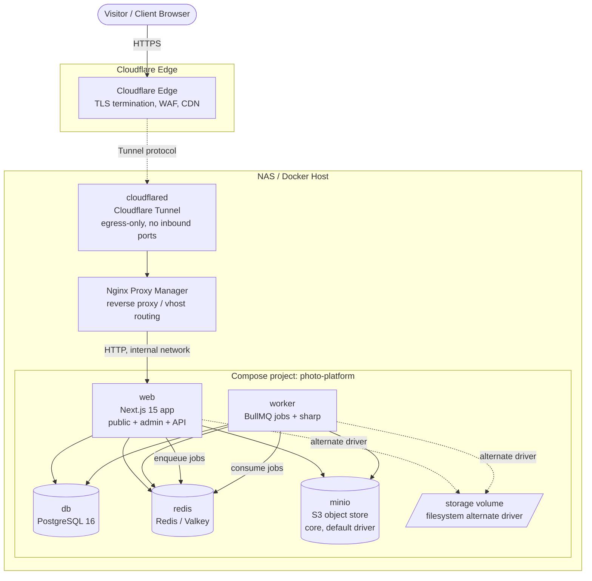

# DEPLOYMENT

> **Phase 0 planning document.** This describes the intended deployment topology, operations, and lifecycle for the self-hosted photography platform. Compose snippets here are **illustrative planning drafts** — the real, finalized Compose stack is produced in **Phase 7** (see `ROADMAP.md`). No application code or production Compose files exist yet.

## 1. Overview

The platform is a single **Next.js 15 (App Router, TypeScript)** application serving the public site, the admin/CMS, and the API, plus a **separate BullMQ worker process** sharing the same codebase. Supporting services are **PostgreSQL 16**, **Redis/Valkey**, and **MinIO** — an S3-compatible object store that is the **default media-storage backend and a core, always-on service**. A filesystem driver remains available as a selectable alternate.

The stack runs on a **NAS** (e.g. Synology / Unraid) under Docker. **Nginx Proxy Manager (NPM)** and **Cloudflare Tunnel (`cloudflared`)** are **external** to this Compose project — they run elsewhere on the NAS (or their own containers) and route inbound traffic to the `web` service. There are **no public inbound ports**; all external traffic arrives via **Cloudflare Tunnel egress** only.

---

## 2. Topology Diagram



**Trust boundary:** Cloudflare terminates TLS and enforces edge security. `cloudflared` makes an outbound-only connection to Cloudflare; nothing on the NAS listens on a public port. NPM is the single internal entry point to `web`.

---

## 3. Compose Topology — Service by Service

The Compose project defines five services. `web`, `worker`, `db`, `redis`, and `minio` are **all core, always-on services** — `minio` is the default media-storage backend and is **not** profile-gated. (Operators who select the filesystem alternate driver may simply leave MinIO unused, but it starts by default.)

| Service | Role | Network exposure | Persistence |
| --- | --- | --- | --- |
| `web` | Next.js app (public + admin + API) | Reachable by NPM on the internal network only | none (stateless) |
| `worker` | BullMQ worker, sharp pipeline | internal only | none (stateless) |
| `db` | PostgreSQL 16 | internal only | `pgdata` volume |
| `redis` | Redis/Valkey (queue + cache) | internal only | optional `redisdata` volume |
| `minio` | **Core** S3-compatible store (default media backend) | internal only (proxied if needed) | `miniodata` volume (mapped to NAS storage) |

### 3.1 `web`
- **Image:** built from the monorepo `Dockerfile` (app target).
- **Depends on:** `db` (condition `service_healthy`), `redis` (condition `service_healthy`), and `minio` (condition `service_healthy`) — MinIO is a core dependency since it is the default storage backend.
- **Healthcheck:** HTTP GET against a lightweight `/api/health` route that checks process liveness (and optionally DB/Redis reachability).
- **Restart policy:** `unless-stopped`.
- **Resource limits:** CPU + memory caps sized for the NAS (e.g. `deploy.resources.limits`); reservations so the app is not starved by the worker during large batch jobs.
- **Volumes:** none required with the default MinIO driver; read access to the shared media volume is mounted only when the filesystem alternate driver is selected.
- **Networks:** `internal` (to reach db/redis/minio) and `proxy` (to be reachable by NPM).

### 3.2 `worker`
- **Image:** same image as `web`, different entrypoint/command (worker process).
- **Depends on:** `db` (`service_healthy`), `redis` (`service_healthy`), and `minio` (`service_healthy`).
- **Healthcheck:** worker liveness probe (e.g. a heartbeat key in Redis or a small internal health endpoint / `pgrep`-style command).
- **Restart policy:** `unless-stopped`.
- **Resource limits:** higher memory ceiling than `web` (sharp + image decoding are memory-hungry); CPU limit to avoid saturating the NAS during derivative generation.
- **Volumes:** none required with the default MinIO driver (it writes derivatives to MinIO over the S3 API); **read/write** access to the shared media volume is mounted only when the filesystem alternate driver is selected.
- **Networks:** `internal` only (no proxy exposure).

### 3.3 `db` (PostgreSQL 16)
- **Healthcheck:** `pg_isready`.
- **Restart policy:** `unless-stopped`.
- **Volumes:** `pgdata` → Postgres data directory.
- **Resource limits:** memory tuned for `shared_buffers` / connection pool; CPU limit appropriate to NAS.
- **Networks:** `internal` only.

### 3.4 `redis` (Redis/Valkey)
- **Healthcheck:** `redis-cli ping`.
- **Restart policy:** `unless-stopped`.
- **Persistence:** see §4 for the on/off rationale.
- **Networks:** `internal` only.

### 3.5 `minio` (core, default media-storage backend)
- **Healthcheck:** MinIO `/minio/health/live` endpoint.
- **Restart policy:** `unless-stopped`.
- **Volumes:** `miniodata` → object store data, **mapped to NAS storage** (e.g. `/volume1/photos/minio`).
- **Env vars:** `MINIO_ROOT_USER` / `MINIO_ROOT_PASSWORD` (server credentials). The app reads `S3_ENDPOINT` (e.g. `http://minio:9000`), `S3_ACCESS_KEY_ID`, `S3_SECRET_ACCESS_KEY`, and `S3_BUCKET` (see §5). A one-time bucket-create (init/`mc`) ensures `S3_BUCKET` exists on first start.
- **Networks:** `internal` only.

### 3.6 Dependency ordering

```
db    (healthy) ─┐
redis (healthy)  ┼──► web
minio (healthy)  ┴──► worker
```

`web` and `worker` both wait for `db`, `redis`, and `minio` to report **healthy** (not merely started) before launching, preventing migration/connection/storage races.

### 3.7 Illustrative Compose skeleton (PLANNING DRAFT — finalized in Phase 7)

> This is a **non-final illustration** to convey shape and intent. Image names, tags, exact healthcheck commands, and resource numbers are placeholders.

```yaml
# planning draft — NOT the production compose file (see Phase 7)
name: photo-platform

services:
  web:
    image: photo-platform:latest        # built from ./Dockerfile
    command: ["node", "server.js"]       # app entrypoint (illustrative)
    env_file: [.env]
    depends_on:
      db:    { condition: service_healthy }
      redis: { condition: service_healthy }
      minio: { condition: service_healthy }   # core: default storage backend
    healthcheck:
      test: ["CMD", "wget", "-qO-", "http://localhost:3000/api/health"]
      interval: 30s
      timeout: 5s
      retries: 3
    restart: unless-stopped
    networks: [internal, proxy]
    # volumes:
    #   - media:/app/storage:ro          # only for the filesystem alternate driver
    deploy:
      resources:
        limits:   { cpus: "1.0", memory: 1g }
        reservations: { memory: 512m }

  worker:
    image: photo-platform:latest
    command: ["node", "worker.js"]       # worker entrypoint (illustrative)
    env_file: [.env]
    depends_on:
      db:    { condition: service_healthy }
      redis: { condition: service_healthy }
      minio: { condition: service_healthy }   # core: default storage backend
    healthcheck:
      test: ["CMD", "node", "scripts/worker-health.js"]
      interval: 30s
      timeout: 5s
      retries: 3
    restart: unless-stopped
    networks: [internal]
    # volumes:
    #   - media:/app/storage:rw          # only for the filesystem alternate driver
    deploy:
      resources:
        limits:   { cpus: "2.0", memory: 2g }
        reservations: { memory: 1g }

  db:
    image: postgres:16
    env_file: [.env]
    healthcheck:
      test: ["CMD-SHELL", "pg_isready -U $${POSTGRES_USER}"]
      interval: 10s
      timeout: 5s
      retries: 5
    restart: unless-stopped
    networks: [internal]
    volumes:
      - pgdata:/var/lib/postgresql/data

  redis:
    image: valkey/valkey:8               # or redis:7
    command: ["valkey-server", "--appendonly", "yes"]   # persistence on (see §4)
    healthcheck:
      test: ["CMD", "redis-cli", "ping"]
      interval: 10s
      timeout: 3s
      retries: 5
    restart: unless-stopped
    networks: [internal]
    volumes:
      - redisdata:/data

  minio:                                 # CORE service — default media-storage backend
    image: minio/minio
    command: ["server", "/data", "--console-address", ":9001"]
    env_file: [.env]
    environment:
      MINIO_ROOT_USER:     ${MINIO_ROOT_USER}
      MINIO_ROOT_PASSWORD: ${MINIO_ROOT_PASSWORD}
    healthcheck:
      test: ["CMD", "curl", "-f", "http://localhost:9000/minio/health/live"]
      interval: 30s
      timeout: 5s
      retries: 3
    restart: unless-stopped
    networks: [internal]
    volumes:
      - miniodata:/data                  # mapped to NAS storage (see §4)

networks:
  internal:           # service-to-service, not reachable from outside
    internal: true
  proxy:              # bridges web <-> Nginx Proxy Manager

volumes:
  pgdata:
  redisdata:
  miniodata:
  media:
```

---

## 4. Volumes & Persistence

| Volume | Backs | NAS mapping | Backup tier |
| --- | --- | --- | --- |
| `pgdata` | PostgreSQL data directory | NAS share, e.g. `/volume1/docker/photo/pg` | **Critical** — dump + volume backup |
| `miniodata` | MinIO object store — originals **and** derivatives (default backend) | NAS share, e.g. `/volume1/photos/minio` | **Critical** (originals); derivatives regenerable |
| `redisdata` | Redis/Valkey AOF/RDB (if persistence on) | `/volume1/docker/photo/redis` | Optional |
| `media` | Filesystem media (only when filesystem alternate driver is selected) | NAS share, e.g. `/volume1/photos/media` | **Critical** (originals) when in use |

**Postgres (`pgdata`)** — durable, must persist; never use a throwaway/tmpfs volume.

**Redis persistence — rationale:** Redis serves two roles. As a **cache** it is fully ephemeral and could run without persistence. As the **BullMQ broker** it holds queue state; losing it mid-flight drops in-progress jobs. Decision: **persistence ON** (AOF) so queued media-processing jobs survive a restart, accepting the small disk/perf cost. Cache misses after a restart are harmless (rebuilt on demand).

**MinIO (`miniodata`)** — the **default** media system of record. Holds **originals** (irreplaceable, must be backed up) and **derivatives** (thumbnails/resized variants, **regenerable** from originals via the sharp pipeline), as objects under the configured bucket(s). Backup-critical for originals. The volume is mapped to NAS storage.

**Media (`media`)** — used **only when the filesystem alternate driver is selected**; then it holds originals + derivatives in subdirectories instead of MinIO. See `MEDIA-ARCHITECTURE.md` for the layout, naming, and derivative strategy (the same opaque-key scheme maps onto object keys or filesystem paths).

> **Storage driver abstraction:** the app uses a `StorageProvider` interface (**MinIO/S3 default, filesystem alternate driver**), so the persistence target is `miniodata` by default and `media` only when the filesystem driver is configured. See `MEDIA-ARCHITECTURE.md`.

---

## 5. Environment Configuration

All configuration is supplied via environment variables, referenced from a committed **`.env.example`** (placeholder names, no secrets) and an operator-maintained **`.env`** (real values, git-ignored). Categories (names below are representative; finalized in Phase 1/7):

- **Database:** `POSTGRES_USER`, `POSTGRES_PASSWORD`, `POSTGRES_DB`, `DATABASE_URL`.
- **Redis:** `REDIS_URL` (and optional `REDIS_PASSWORD`).
- **Auth secrets (Better Auth):** session/encryption secret(s) (e.g. `AUTH_SECRET`), TOTP/passkey config, cookie domain, trusted origins.
- **Storage driver + creds:** `STORAGE_DRIVER` (defaults to `minio`/`s3`; `filesystem` is the alternate). For the default object storage: `S3_ENDPOINT` (e.g. `http://minio:9000`), `S3_REGION`, `S3_BUCKET`, `S3_ACCESS_KEY_ID`, `S3_SECRET_ACCESS_KEY`, plus the MinIO server credentials `MINIO_ROOT_USER` / `MINIO_ROOT_PASSWORD`. For the filesystem alternate: a filesystem base path.
- **Email driver:** `EMAIL_DRIVER` (`smtp` | `resend`), SMTP host/port/user/pass or `RESEND_API_KEY`, from-address.
- **Public origin / base URL:** `APP_BASE_URL` / `NEXT_PUBLIC_ORIGIN` (the public Cloudflare hostname).
- **Cloudflare / NPM hostnames:** the public hostname served via Tunnel and the internal upstream NPM points at (used for redirects, CSP, cookie domain, trusted proxy config).
- **Worker / queue:** queue names, concurrency limits.

> No secret values are stored in these docs or in `.env.example`. Real secrets live only in the operator's `.env` (or the NAS secret store) and are never committed.

---

## 6. Networking

- **Internal Docker network (`internal`):** `db`, `redis`, `minio`, `worker`, and `web` communicate by service name. Marked `internal: true` so it is not routable from outside the Compose project.
- **`web` is the only externally reachable service**, and only via the `proxy` network shared with NPM. `db`/`redis`/`minio`/`worker` are never exposed to NPM or the host.
- **NPM → web:** NPM defines a proxy host whose upstream is `http://web:3000` (over the shared `proxy` network). NPM does not need to terminate TLS for the public path (Cloudflare does), but may use internal certificates between Tunnel/NPM if desired.
- **Cloudflare Tunnel → NPM:** `cloudflared` runs externally with an ingress rule mapping the public hostname (e.g. `photos.example.com`) to NPM's listening address. The tunnel is **egress-only**; no inbound ports are opened on the NAS or router.
- **TLS:** terminated at **Cloudflare's edge**. The hop from Cloudflare to the origin is carried inside the tunnel.
- **Trusted proxy / `X-Forwarded-*`:** because requests traverse Cloudflare → Tunnel → NPM → web, Next.js must trust forwarded headers to reconstruct the true client IP, scheme (`https`), and host. Configure the app to honor `X-Forwarded-For` / `X-Forwarded-Proto` / `X-Forwarded-Host` (and Cloudflare's `CF-Connecting-IP`) **only from the known proxy chain**, so rate-limiting, lockout, audit logs, secure-cookie issuance, and absolute URL generation use correct values. Pin the trusted upstream(s) rather than trusting all proxies.

---

## 7. Backups

**What to back up**
1. **PostgreSQL** — logical dumps (`pg_dump`) plus periodic `pgdata` volume snapshots. The database is the system of record for users, galleries, grants, page-config, and media metadata.
2. **Media originals** — irreplaceable source images (`miniodata` objects by default, or the `media` originals subdir when using the filesystem alternate driver). **Derivatives are NOT backed up** — they are regenerable by re-running the sharp pipeline.
3. **Configuration** — `.env` (stored securely, separately from code), NPM and Cloudflare Tunnel config (managed in their own external locations).

**Schedule (target)**
- Postgres dump: **nightly**, retained on a grandfather-father-son cadence (e.g. 7 daily / 4 weekly / 6 monthly).
- Media originals: **nightly incremental** sync (originals change only on upload).
- Volume snapshots (NAS-native, if available): per NAS snapshot policy.

**Offsite option** — replicate Postgres dumps and media originals to **Cloudflare R2** (or another S3 target) on a daily/weekly cadence for disaster recovery off the NAS.

**Restore procedure (outline)**
1. Stand up `db` from the target Compose stack (empty volume).
2. Restore the chosen Postgres dump (`pg_restore` / `psql`).
3. Restore media originals to the `miniodata` object store (or the `media` volume when using the filesystem alternate driver).
4. Start `worker` and **regenerate derivatives** from originals.
5. Start `web`, run a health check, verify a sample public gallery and admin login.

> See `MEDIA-ARCHITECTURE.md` for the originals/derivatives split that makes derivative regeneration possible and keeps the backup set small.

---

## 8. Upgrade Procedure

**Goal:** apply new application versions and database migrations with minimal downtime and a clear rollback path.

1. **Prepare** — review the changelog and pending Drizzle migrations. Confirm a fresh backup exists (§7).
2. **Build / pull** the new image tag (immutable, versioned tag — not only `latest`).
3. **Run migrations** — execute Drizzle migrations against `db` (one-shot migration step or `web` startup migration gate). Prefer **backward-compatible (expand) migrations** so the old image keeps working during the swap.
4. **Roll the app** — recreate `web` (and `worker`) on the new image. With a single host, a brief restart is acceptable ("zero-ish downtime"); for smoother cutover, start a new `web` container, wait for **healthy**, then retire the old one before NPM repoints (NPM upstream by service name keeps this simple).
5. **Verify health** — `/api/health` green, worker consuming jobs, sample public page + admin login + one media upload → derivative generation.

**Rollback**
- Redeploy the **previous image tag** for `web`/`worker`.
- **Migration caution:** rolling code back is safe; rolling the **schema** back is not generally safe. Favor expand/contract migrations so a code rollback does not require a schema rollback. If a destructive (contract) migration already ran, restore from the pre-upgrade Postgres backup instead of attempting to reverse it.

---

## 9. Run-book (one page)

**Where things live**
- Compose project & `Dockerfile`: repo root (finalized Phase 7).
- App entrypoint = `web`; jobs = `worker`; both from the **same image**.
- Data: `pgdata` (Postgres), `redisdata` (queue/cache), `miniodata` (MinIO objects — default media store, mapped to NAS storage), `media` (only when the filesystem alternate driver is selected).
- Config: `.env` (operator-held). External: NPM proxy host + `cloudflared` ingress rule.

**Start / stop**
- Start the full core stack (includes `minio`): `docker compose up -d`
- Stop: `docker compose down` (volumes persist; data is safe)
- Restart one service: `docker compose restart web`

**Logs**
- All: `docker compose logs -f`
- One service: `docker compose logs -f web` / `worker`
- Watch the worker during large uploads to confirm sharp derivative jobs complete.

**Common ops**
- Run migrations: invoke the Drizzle migration command in the `web` image (one-shot).
- Open a DB shell: `docker compose exec db psql -U "$POSTGRES_USER" "$POSTGRES_DB"`
- Inspect queues: `docker compose exec redis redis-cli` (BullMQ keys).
- Regenerate derivatives: trigger the worker's reprocess job (see admin/CMS, Phase 5).
- Health: `curl http://web:3000/api/health` (from inside the network) or via NPM.

**Health & connectivity checklist**
- `db` reports healthy (`pg_isready`), `redis` responds to `ping`.
- `web` health endpoint returns 200; worker heartbeat present.
- NPM upstream resolves `web:3000`; Cloudflare hostname loads over HTTPS.
- No service other than `web` is on the `proxy` network; no public inbound ports open.
