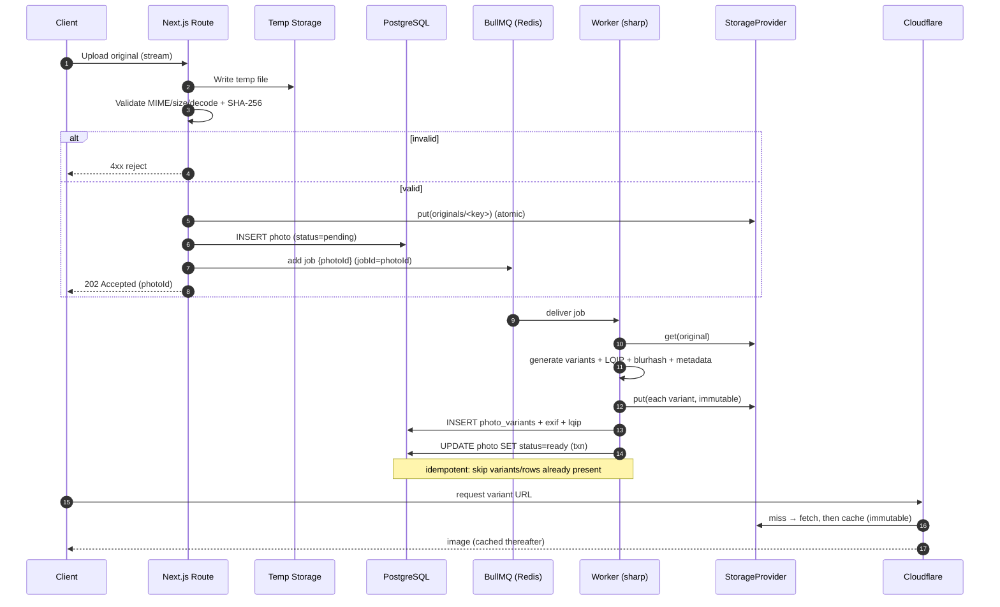

# Media Architecture

Living media-subsystem reference for how original photos and their web derivatives are
stored, processed, served, and protected on the self-hosted photography platform.

> **Scope note:** This document describes the media subsystem only (storage, the sharp
> pipeline, metadata, backups). Delivery/caching tuning lives in `PERFORMANCE.md`.

---

## 1. Core principles

1. **Originals are sacred.** Original uploads are the only irreplaceable asset. They are
   written once, never mutated, and never have EXIF stripped, and are used for full-quality
   client ZIP downloads. Everything else (every WebP/JPEG variant, every LQIP) is
   *regenerable* from the original.
2. **Derivatives are disposable.** Any derivative can be deleted and rebuilt by replaying
   the pipeline. This is what lets us add a new format/size years later (backfill) and
   keeps derivative backups optional.
3. **Storage keys are opaque.** For private client galleries, no URL or storage key may be
   guessable. Object keys are derived from content hash + random salt, never from filename,
   gallery name, or sequential id. (The same scheme applies whether keys are S3 object keys
   or filesystem paths.)
4. **The DB is the index, storage is the blob store.** Storage holds bytes only. All
   relationships, metadata, variant lists, and readiness state live in PostgreSQL. The
   object/key layout is never queried directly by the app.
5. **Provider-agnostic.** All reads/writes go through a `StorageProvider` interface.
   The **default implementation is SeaweedFS (S3-compatible)**, run as a core service from day
   one; a **filesystem volume on the NAS is the selectable alternate driver**. (SeaweedFS
   replaced MinIO as the S3 backend — see ADR-0024; the abstraction is unchanged.)

---

## 2. StorageProvider abstraction

The application never touches `fs` or an S3 SDK directly. It depends on a narrow
interface so the SeaweedFS/S3 default and the filesystem alternate implementation are
interchangeable.

```ts
interface StorageProvider {
  put(key: string, body: Buffer | Readable, opts: PutOpts): Promise<void>;
  get(key: string): Promise<Readable>;
  head(key: string): Promise<{ size: number; etag: string } | null>;
  delete(key: string): Promise<void>;
  // Pre-signed / time-limited URL for private delivery. For the filesystem
  // provider this is a signed token validated by a Next.js route handler.
  signedUrl(key: string, ttlSeconds: number): Promise<string>;
}

interface PutOpts {
  contentType: string;
  immutable?: boolean;   // sets long cache headers when served via CDN
  cacheControl?: string;
}
```

- **S3/SeaweedFS provider (default):** maps `key` → object key within the configured bucket;
  `signedUrl` uses native S3 pre-signed URLs. This is the day-one backend.
- **Filesystem provider (alternate):** maps the same `key` → a path under the storage
  root, writes atomically (write to `*.tmp` then `rename`), and serves private objects
  through an authenticated Next.js route that streams the file after authorization +
  signature check.

Because keys are opaque and the layout below is just a key-naming convention, switching
providers requires no key migration — the **same keys are object keys in SeaweedFS/S3 and
path segments on the filesystem**.

---

## 3. Storage layout

The layout is described primarily as **S3/SeaweedFS object keys** (the default backend). The
**filesystem alternate driver maps the identical keys onto directory paths** under a
storage root — every key below is both an object key and a path, with `/` separators
already aligning to both models.

### 3.1 Two top-level key prefixes (buckets/prefixes)

```
originals/      # write-once, never stripped, irreplaceable  → backup tier 1
derivatives/    # regenerable variants + LQIP source         → backup optional
```

These may be two buckets or two key prefixes within one bucket (and, on the filesystem
alternate driver, two top-level subdirectories under the storage root). Either way,
originals and derivatives are split at the top level so backup policy is trivial: back up
`originals/` aggressively, treat `derivatives/` as a cache.

### 3.2 Identity and naming

Each uploaded file gets:

- `photoId` — a ULID/UUID (DB primary key, opaque).
- `contentHash` — SHA-256 of the original bytes (used for dedupe + integrity).
- `storageSalt` — random 8-byte hex generated at upload, stored in the DB row. It makes
  the on-disk key unguessable even if an attacker knows the content hash.

**Sharding.** To keep key listings and (on the filesystem driver) directory fan-out
manageable, we shard by the first 4 hex chars of a *sharding key*. The sharding key is
`HMAC(secret, photoId)` (so shard distribution is even and not derivable from the public
id). First 2 chars = level-1 prefix, next 2 = level-2 prefix → up to 65,536 leaf buckets.
(On S3 these are flat key prefixes; on the filesystem they become nested directories.)

**Key format.** (Identical object keys / filesystem paths — `/`-separated.)

```
originals/<aa>/<bb>/<photoId>__<contentHash>.<ext>

derivatives/<aa>/<bb>/<photoId>/<storageSalt>/<size>.<format>
derivatives/<aa>/<bb>/<photoId>/<storageSalt>/lqip.txt   (optional; LQIP also lives in DB)
```

- `<aa>/<bb>` = shard prefix (from the HMAC sharding key).
- The `<storageSalt>` segment in the derivatives path is what makes private-gallery URLs
  unguessable: even if someone learns a `photoId`, they cannot construct the derivative
  key without the per-photo salt (which is only served to authorized viewers via signed
  URLs).
- `<size>` ∈ `{thumb, small, medium, large, xlarge}`; `<format>` ∈ `{webp, jpg}`
  (WebP at every size; **one** JPEG fallback at the `large` bucket — ADR-0019).

### 3.3 Example key set (shown as a tree; on SeaweedFS/S3 these are object keys, on the filesystem driver these are paths under the storage root)

```
(bucket or storage root)/
├── originals/
│   ├── 3f/
│   │   └── a1/
│   │       └── 01J8XK…__9c1f2b…e7.cr3          # RAW original, full EXIF intact
│   └── b2/
│       └── 7d/
│           └── 01J8XM…__4ad90c…11.jpg
└── derivatives/
    ├── 3f/
    │   └── a1/
    │       └── 01J8XK…/
    │           └── 7c4e9af2/                    # storageSalt
    │               ├── thumb.webp
    │               ├── small.webp
    │               ├── medium.webp
    │               ├── large.webp
    │               ├── large.jpg                 # the ONE JPEG fallback
    │               ├── xlarge.webp
    │               └── lqip.txt
    └── b2/ …
```

---

## 4. Variant strategy

### 4.1 Size buckets

We generate a fixed ladder of widths. Heights follow the source aspect ratio (we never
crop in the pipeline; cropping/art-direction is a future, separate concern).

| Bucket   | Target width (CSS px) | Generated width | Typical use                         |
| -------- | --------------------- | --------------- | ----------------------------------- |
| `thumb`  | 400                   | 400             | Grid thumbnails, contact sheets     |
| `small`  | 800                   | 800             | Mobile full-bleed, list views       |
| `medium` | 1600                  | 1600            | Desktop gallery / lightbox default  |
| `large`  | 2400                  | 2400            | Hi-DPI lightbox, large displays     |
| `xlarge` | 3840                  | 3840            | 4K / very large displays            |
| `original` | (native)            | native          | Full-quality client ZIP downloads / print sales |

- **Why these:** they map cleanly onto common breakpoints and DPR. The responsive buckets
  handle DPR through `srcset` width descriptors, which keeps the variant count manageable.
- **`original`** is never web-optimized. **Originals are preserved untouched** and served
  only through authenticated paths — full-quality **client ZIP downloads** and
  print-fulfillment — never referenced from `srcset`.

### 4.2 Formats and quality (ADR-0019 — WebP-primary)

App delivery is **WebP-primary**. We emit **WebP at every responsive bucket**
(`thumb`/`small`/`medium`/`large`/`xlarge`) plus exactly **one JPEG fallback** at the
`large` bucket:

| Format | Role                       | Buckets | sharp settings | Notes |
| ------ | -------------------------- | ------- | -------------- | ----- |
| WebP   | primary `<source>`         | all five | `quality: 82`, `effort: 4` | Small, fast, broadly supported |
| JPEG   | single `` fallback    | `large` only | `quality: 82`, `mozjpeg: true`, progressive | The lone fallback for the rare non-WebP client |

- **Why dropped AVIF + per-bucket JPEG:** the earlier "three formats × every bucket" matrix
  multiplied **storage and encode CPU**. WebP at quality ~82 is near-visually-lossless for
  portfolio display at a fraction of the bytes; a single `large` JPEG covers the universal
  `` fallback. AVIF and JPEG-proliferation were dropped to cut storage and encode
  time. (AVIF can be reintroduced later as a backfill if measured to be worth it.)
- **Originals are preserved untouched** and used for **full-quality client ZIP downloads**
  (and print sales). Nothing about the WebP-primary delivery strategy touches the original.
- **Progressive JPEG** for better perceived load on the single fallback.

### 4.3 Upscaling, DPR, srcset/sizes

- **Never upscale.** If an original is narrower than a bucket's target width, we skip that
  bucket (and any larger ones). `sharp.resize(width, null, { withoutEnlargement: true })`.
  The DB records exactly which variants exist, so `srcset` only ever lists real files.
- **DPR** is handled with width descriptors (`360w`, `800w`, …) plus a `sizes` attribute,
  letting the browser pick by viewport × device pixel ratio. We do not hand-author `1x/2x`
  except for `thumb`.
- **srcset/sizes generation:** a server helper reads the photo's variant rows and emits a
  `<picture>` with one `<source type="image/webp">` (the WebP ladder across all buckets) and
  an `` pointing at the single `large` JPEG fallback. The `<source>` gets a `srcset` of
  `"<url> <width>w"` entries for every existing WebP variant, plus the gallery-context
  `sizes` string.

  Example output shape:

  ```html
  <picture>
    <source type="image/webp"
            srcset="…/thumb.webp 400w, …/small.webp 800w, …/medium.webp 1600w, …/large.webp 2400w, …/xlarge.webp 3840w"
            sizes="(max-width: 768px) 100vw, 50vw">
    
  </picture>
  ```

  `width`/`height` are always set (from extracted dimensions) to reserve layout space and
  eliminate CLS.

### 4.4 LQIP / blur placeholder

- For each photo we generate a **tiny placeholder** to show instantly while the real image
  loads, preventing layout shift and giving the Pixieset-grade "fade-in" feel.
- **Method:** sharp resizes the original to ~20px wide, blurs, encodes a minimal JPEG, and
  base64-encodes it (typically < 1 KB). We also compute a **blurhash** string as a compact
  alternative for clients that prefer canvas rendering.
- **Storage:** the base64 LQIP and the blurhash string are stored **in the DB** on the
  photo row (so the page HTML can inline them with zero extra requests). A copy may also be
  written to `derivatives/.../lqip.txt` for regeneration convenience, but the DB is the
  source of truth used at render time.
- **Dominant color** is extracted at the same time (sharp `stats()`) and stored in the DB;
  it is used as the `` background before even the LQIP paints.

---

## 5. EXIF / metadata handling

| Field group               | On original | On web variants | Extracted to DB |
| ------------------------- | ----------- | --------------- | --------------- |
| All EXIF/IPTC/XMP         | **Preserved verbatim** | **Stripped** | n/a |
| GPS / geolocation         | Preserved   | **Stripped (privacy-critical)** | Not stored unless explicitly opted in per gallery |
| Orientation tag           | Preserved   | **Baked in + tag removed** (auto-rotate) | Stored as final w/h |
| Capture date/time         | Preserved   | Stripped | ✅ `capturedAt` |
| Camera make/model, lens   | Preserved   | Stripped | ✅ for portfolio display |
| Exposure (ISO, f, shutter)| Preserved   | Stripped | ✅ optional display |
| Color profile (ICC)       | Preserved   | Converted to sRGB for web | ✅ source profile noted |
| Dimensions                | Preserved   | n/a | ✅ `width`,`height` |
| Dominant color, LQIP, blurhash | n/a    | n/a | ✅ |

Key rules:

- **Strip everything from web variants by default**, then selectively re-derive only what
  we *choose* to display from DB columns. This guarantees no GPS leaks even if extraction
  logic changes. sharp drops metadata unless `withMetadata()` is called — for web variants
  we deliberately do **not** call it (except to set sRGB ICC).
- **Orientation is normalized** (`sharp.rotate()` with no args honors EXIF orientation and
  bakes it into pixels) so browsers never need the orientation tag and we avoid sideways
  thumbnails.
- **Color management:** convert to sRGB for web variants (`.toColorspace('srgb')` /
  pipeline ICC). Originals keep their embedded profile (e.g. Adobe RGB / ProPhoto) for
  printing.
- Metadata extraction uses `sharp.metadata()` plus an EXIF parser; values land in
  `photos`/`photo_exif` tables.

---

## 6. Processing pipeline

### 6.1 Stages

1. **Upload** → multipart/resumable upload received by a Next.js route handler. Streamed to
   a **temp** location, not directly into `originals/`.
2. **Validate** → check declared vs. sniffed MIME, max dimensions/file size, decodability
   (sharp can open it), and compute `contentHash` (SHA-256). Reject early on failure.
   Dedupe check: if `contentHash` already exists, link to existing original instead of
   re-storing.
3. **Promote original** → `StorageProvider.put()` writes the temp file to its final
   `originals/...` key atomically. Create the `photos` DB row in state `pending`.
4. **Enqueue** → push a BullMQ job `{ photoId }` onto the `media-processing` queue. The
   job id is `photoId` (see idempotency).
5. **Process (worker)** → sharp generates every applicable variant (size × format),
   generates LQIP + blurhash + dominant color, extracts metadata. CPU-bound work happens
   here, off the request path.
6. **Persist** → write each variant via `StorageProvider.put(..., { immutable: true })`,
   insert `photo_variants` rows, write extracted metadata, write LQIP/blurhash to the
   photo row.
7. **Mark ready** → flip `photos.status` to `ready` in a single transaction *after* all
   variants are written and rows inserted. Until then the photo is never shown publicly.
8. **Cache/CDN** → because variant keys are content-addressed and immutable, they get
   long-lived `Cache-Control: public, max-age=31536000, immutable` headers (see
   `PERFORMANCE.md`). First request warms Cloudflare's cache.

### 6.2 Sequence diagram



### 6.3 Idempotency

- BullMQ **job id = `photoId`**, so duplicate enqueues collapse to one job.
- Each variant write is keyed by its deterministic storage key; the worker checks
  `StorageProvider.head(key)` (or a `photo_variants` row) and **skips** anything already
  present. A re-run produces the same keys and the same DB rows (upsert by
  `(photoId, size, format)` unique constraint).
- The final `status=ready` flip is the commit point; partial runs leave the photo
  `processing` and safe to retry.

### 6.4 Retries & failure handling

- BullMQ retry policy: `attempts: 5`, exponential backoff (e.g. 2s → 30s), with jitter.
- Distinguish **transient** (storage timeout, OOM-killed) from **permanent** (corrupt
  source sharp cannot decode) failures. Permanent failures go straight to a **dead-letter**
  state: `photos.status = failed` with an error reason; no further retries.
- A failed photo is never shown. An admin view lists `failed`/`processing` photos for
  manual reprocess.
- Workers are crash-safe: because the pipeline is idempotent, a worker dying mid-job just
  causes BullMQ to redeliver, and already-written variants are skipped.

### 6.5 Reprocessing & backfill

Driven entirely off originals, so it is always possible:

- **Add a new format/size later** (e.g. JPEG XL, or a new `xlarge` bucket): bump a
  `pipelineVersion` constant, enqueue a backfill job per photo. The worker generates only
  the missing variants (head-check skips existing ones), inserts new `photo_variants`
  rows, and leaves everything else untouched.
- **Re-encode at new quality:** delete the affected variant rows + objects, then enqueue
  reprocess. Originals are never touched.
- **Backfill throughput** is rate-limited via a separate low-priority queue so it does not
  starve live uploads.
- `photos.pipelineVersion` records what version produced the current derivatives, making it
  easy to query "all photos below version N" for targeted backfills.

---

## 7. Backups

### 7.1 What to back up vs. regenerate

| Asset                  | Backup tier | Strategy                                         |
| ---------------------- | ----------- | ------------------------------------------------ |
| `originals/`           | **Tier 1 — must**  | 3-2-1: NAS + local snapshot + offsite copy |
| PostgreSQL (DB)        | **Tier 1 — must**  | Nightly logical dump + WAL/PITR; this is the index, LQIP, metadata, relationships |
| `derivatives/`         | Tier 3 — optional  | Regenerable; back up only to save rebuild time/CPU |
| Redis (BullMQ)         | Not backed up      | Transient queue state; rebuildable |
| App config / secrets   | Tier 1 — must      | Stored in secret manager / encrypted, versioned |

**Originals + DB are the only irreplaceable pair.** Lose derivatives → rebuild with a
backfill job. Lose originals → permanent data loss (and lost print-sale capability), so
they are protected hardest.

### 7.2 Tiers & topology

- **Snapshot tier (NAS):** ZFS/Btrfs snapshots of the storage volume give cheap,
  point-in-time, copy-on-write rollback (ransomware/accidental-delete protection).
- **File-level tier (offsite):** since originals are write-once and content-addressed,
  incremental file-level sync (restic/rclone) to **Cloudflare R2** (optional offsite) is
  efficient — new objects only, no churn. R2 also makes a future "serve originals from
  cloud" path easy.
- **Snapshot vs. file-level:** snapshots protect the whole volume cheaply but live on the
  same NAS (single-site risk); file-level offsite protects against site loss. We use both.
- **DB:** nightly `pg_dump` + continuous WAL archiving to R2 for point-in-time recovery.

### 7.3 Integrity checks

- Every original's `contentHash` (SHA-256) is stored at upload. A periodic **scrub** job
  re-hashes a rolling sample of originals and compares, detecting bit-rot or corruption.
- The default SeaweedFS/S3 backend provides its own object integrity (ETag/checksums) as a
  first line; the filesystem alternate driver relies on the underlying CoW filesystem's
  checksums (ZFS/Btrfs). The app-level hash check is provider-independent and applies to
  both.
- Backup restores are **test-restored** on a schedule (a backup you have not restored is a
  hypothesis, not a backup).

---

## 8. Worker concurrency & throughput

sharp is CPU-bound (native libvips), so the worker is sized around cores and memory, not
I/O.

- **Queue concurrency** ≈ number of physical cores (start at `concurrency = cores - 1` to
  leave headroom for the OS / Postgres / Nginx on a single-box NAS). Over-subscribing CPU
  hurts total throughput.
- **libvips threading:** sharp already parallelizes a single image across threads. Running
  many concurrent jobs *and* high per-image threading oversubscribes — pin
  `sharp.concurrency(1)` (or low) per job when running multiple jobs in parallel, and let
  job-level concurrency provide the parallelism.
- **Memory:** large originals (RAW, 40–100 MP) can spike RAM during decode. Set a
  per-worker memory ceiling, process one large image at a time per worker, and prefer
  streaming/sequential reads. Reject pathologically large inputs at validation.
- **Backpressure:** a bounded queue + separate **low-priority backfill queue** keeps live
  uploads responsive while bulk reprocessing runs in the background.
- **Isolation:** the worker runs as its own Docker Compose service so its CPU spikes never
  block the Next.js request path or the DB.

---

## 9. Open questions for Phase 1

- WebP quality (currently ~82) re-validated against SSIM + human review per surface.
- Whether to reintroduce AVIF (or add JPEG XL) as a backfilled `<source>` once the
  storage/encode-CPU cost is justified by measured byte savings (dropped in ADR-0019).
- Watermarking strategy for proof galleries (likely a separate, on-the-fly derivative).
- Resumable upload protocol choice (tus vs. chunked custom).
