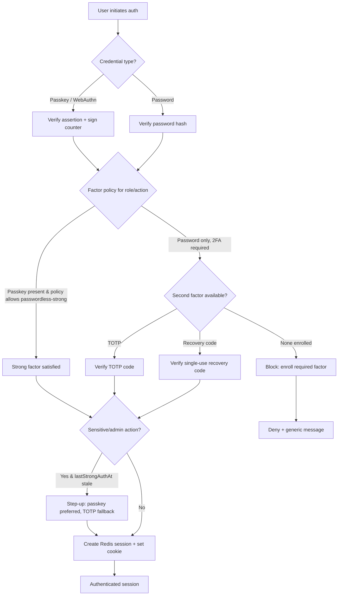

# SECURITY.md — Phase 0 Security Plan

> Self-hosted photography platform: public site + private client galleries + light print store.
> Replaces WordPress/WooCommerce. Hosted on a NAS, fronted by Nginx Proxy Manager (NPM) +
> Cloudflare Tunnel (no public inbound ports — Cloudflare Tunnel **egress only**).

This document is authoritative for Phase 0 security decisions. It defines the threat model,
auth flows, account protection, session handling, HTTP/CSP headers, upload validation,
private gallery access control, secrets handling, and a per-area audit checklist.

---

## 1. Threat Model

### 1.1 Assets (what we are protecting)

| Asset | Sensitivity | Impact if compromised |
|-------|-------------|-----------------------|
| Original full-resolution photographs | High | IP theft, loss of commercial value, client trust loss |
| Client PII (names, emails, gallery contents, order/shipping data) | High | Privacy breach, legal exposure (GDPR/CCPA), reputational damage |
| Admin credentials & sessions (owner/admin/staff) | Critical | Full platform takeover, data exfiltration, defacement |
| Client gallery share tokens & gallery passwords | High | Unauthorized access to private galleries |
| Payment provider keys / webhook secrets | Critical | Financial fraud, chargebacks |
| Database (PostgreSQL) & Redis/Valkey state | Critical | Mass exfiltration, session forgery |
| Infrastructure secrets (.env, Cloudflare Tunnel token, SMTP creds) | Critical | Lateral movement, account takeover, spam relay |

### 1.2 Attacker capabilities (assumed)

- **Remote unauthenticated attacker**: can reach only what Cloudflare exposes (HTTPS hostname(s)
  routed through the Tunnel). Can attempt credential stuffing, token brute force, enumeration,
  injection, malicious uploads, CSRF, XSS, SSRF probes.
- **Authenticated low-privilege actor**: a client with a valid gallery grant, or a `staff` admin.
  May attempt privilege escalation, IDOR (insecure direct object reference), horizontal access
  to other clients' galleries.
- **Network-adjacent attacker on the LAN/NAS network**: can attempt to reach Postgres/Redis/
  internal services directly if they are not bound to localhost / internal Docker network.
- **Supply-chain / dependency attacker**: malicious npm package, compromised base image.
- **Stolen-credential attacker**: phished password, leaked token, or stolen device/session cookie.

Out of scope (accepted risk, documented): physical seizure of the NAS, a fully compromised host
OS with root, and a compromised Cloudflare account. These are mitigated operationally (disk
encryption, host hardening, Cloudflare 2FA) but are not application-layer controls.

### 1.3 Trust boundaries

```
[ Internet ] ──TLS──> [ Cloudflare Edge ] ──Tunnel (outbound TLS)──> [ cloudflared on NAS ]
                                                                            │
                                                                            ▼
                                                                  [ Nginx Proxy Manager ]
                                                                            │  (internal Docker net)
                          ┌─────────────────────────────────────┬─────────┴───────────┐
                          ▼                                       ▼                     ▼
                   [ Next.js app ]                         [ BullMQ worker ]      [ Storage volume ]
                          │                                       │              (originals + variants,
              ┌───────────┼───────────┐                          │               OUTSIDE web root)
              ▼           ▼           ▼                          ▼
        [ Postgres ]  [ Redis ]  [ Email/Payment providers ]  [ sharp pipeline ]
```

Boundaries that matter:
- **Internet → Cloudflare**: untrusted → Cloudflare-mediated.
- **Cloudflare → cloudflared → NPM**: the *only* ingress path. Everything behind NPM must assume
  requests can be hostile despite passing the edge.
- **App ↔ Postgres/Redis**: internal Docker network only; never published to the host/LAN.
- **App/Worker ↔ Storage**: SeaweedFS/S3-compatible storage by default, with a filesystem
  alternate; never served directly by a web server from a public path.

### 1.4 What Cloudflare Tunnel + NPM DO protect

- **No public inbound ports**: the NAS firewall exposes nothing; `cloudflared` makes an outbound
  connection to Cloudflare. This removes the entire class of "scan the IP and hit the service."
- **TLS termination at the edge**: valid certs, modern ciphers handled by Cloudflare.
- **Edge DDoS absorption & basic WAF** (depending on plan): volumetric and some L7 filtering.
- **Hostname-based routing & access policies** (optional Cloudflare Access) for admin paths.
- **NPM**: hostname routing, per-host TLS to upstream, basic proxy rules.

### 1.5 What they DO NOT protect

- **Application logic flaws**: IDOR, broken access control, injection, business-logic abuse — all
  pass straight through. The app is fully responsible.
- **Authentication**: CF Tunnel does not authenticate end users (unless Cloudflare Access is
  explicitly layered on admin routes — recommended, but not a substitute for app auth).
- **Authenticated-attacker actions**: a valid client/staff session is honored end to end.
- **Malicious uploads**: the edge does not inspect image payloads.
- **Secrets at rest**: `.env`, DB contents, tokens are the app/host's responsibility.
- **Cache leakage**: if the app mislabels private content as cacheable, the edge may cache it
  (see CACHING-STRATEGY.md — private gallery content must be `no-store`).
- **CSRF / session security**: handled entirely by the app (Better Auth + cookie policy).

**Design principle:** treat every request reaching the app as if it came from the open internet.
CF Tunnel is a port-exposure and DDoS control, **not** an authorization layer.

---

## 2. Authentication Flows

Auth is built on **Better Auth**: password + TOTP 2FA + WebAuthn/passkeys, with built-in rate
limiting, max-attempt lockout, and session management. **Passkeys are a STRONGER factor and are
passwordless-capable.** An **admin factor policy** decides which factors are required for a given
role/action; passkeys may satisfy that policy on their own and are never treated as a weak override.

### 2.1 Password login

1. Client submits email + password over TLS.
2. Server normalizes email, looks up user, verifies hash (argon2id/scrypt via Better Auth).
3. On success, evaluate factor policy (below). If a second factor is required and not yet
   satisfied, issue a short-lived **partial/pending** session marked `mfaPending` and prompt for
   the second factor.
4. On full success, create a session (Redis-backed) and set the session cookie.
5. **Generic errors only** ("Invalid email or password") — never reveal which field was wrong or
   whether the account exists.

### 2.2 TOTP enrollment + verify

- **Enroll**: server generates a TOTP secret, returns provisioning URI + QR. User scans, submits
  a current code to confirm. Secret is only persisted after a successful confirm. On confirm,
  **issue recovery codes** (§2.6).
- **Verify** (login / step-up): accept the current 6-digit code with a ±1 step window for clock
  drift; enforce single-use within the window (replay protection via Redis marker).
- TOTP secrets stored encrypted at rest (app-level encryption key from secrets store).

### 2.3 Passkey / WebAuthn registration + login

- **Register**: server issues a WebAuthn challenge (`navigator.credentials.create`). Verify
  attestation, store the credential ID + public key + sign counter + transports. Bind to the user.
  Registering a passkey requires an already-authenticated session (or step-up) to prevent
  attacker-bound credentials.
- **Login**: server issues an assertion challenge (`navigator.credentials.get`); verify signature
  and **monotonic sign counter** (reject counter regressions → possible cloned authenticator).
- **Passwordless**: a passkey login can satisfy the full factor policy by itself for roles where
  policy permits, because it is phishing-resistant and hardware/platform-bound.

### 2.4 Step-up auth for sensitive admin actions

Sensitive actions (changing the factor policy, deleting galleries/originals, exporting client PII,
rotating tokens, managing other admins, payment settings) require **fresh** authentication:

- Require a re-assertion within the last *N* minutes (e.g. 5–15). If stale, force a step-up
  challenge (passkey assertion preferred; TOTP fallback).
- Step-up is recorded on the session as `lastStrongAuthAt`; mutations check it server-side.

### 2.5 Factor policy (admin-controlled)

The **admin factor policy** is a configurable rule set, not hardcoded per user:

- Policy can mandate: "owner/admin must have a strong factor (passkey) OR password+TOTP";
  "staff must have at least password+TOTP"; "step-up requires a strong factor."
- A **passkey is classified as a strong/phishing-resistant factor** and can be passwordless. It is
  **never** treated as a weak override that bypasses required factors — rather, it *satisfies or
  exceeds* the requirement.
- Clients (gallery access) are governed by share tokens + optional gallery password (§6), not by
  the admin factor policy.



### 2.6 Recovery codes

- Generated once at 2FA enrollment, displayed exactly once, stored **hashed** (never plaintext).
- Single-use; consuming one marks it used in the DB. Warn when few remain; allow regeneration
  (which invalidates all prior codes) behind step-up.
- Treated as a fallback strong-ish factor; using one should prompt the user to re-establish a
  primary factor and may trigger a security-notification email.

---

## 3. Account Protection

### 3.1 Rate limiting (Redis-backed)

- Better Auth's built-in rate limiting backed by Redis/Valkey so limits are shared across app
  instances and survive restarts.
- Limit **per identifier** (account/email) **and per IP** (client IP from the Tunnel —
  ensure NPM/cloudflared forward a trustworthy `CF-Connecting-IP`; do not trust arbitrary
  `X-Forwarded-For`).
- Apply to: login, TOTP verify, passkey assertion, password reset, gallery-password attempts,
  and share-token resolution.
- Sliding-window or token-bucket counters keyed e.g. `rl:login:ip:<ip>` and `rl:login:acct:<id>`.

### 3.2 Max-attempt lockout policy

- **Thresholds**: soft throttle after a small number of failures (e.g. 5), then exponential
  **backoff** (delays increasing per failure), then a temporary **account lockout** after a higher
  threshold (e.g. 10) for a cooldown window (e.g. 15–30 min).
- **Unlock**: automatic on cooldown expiry; manual unlock by an admin; or user-initiated via a
  verified password-reset / email-confirmed flow. Lockout state stored in Redis with TTL plus a
  durable counter so it cannot be trivially reset by cycling IPs.
- Lockouts and repeated failures emit security events/logs and (optionally) a notification email.

### 3.3 Credential-stuffing defense

- Generic errors + uniform response timing (avoid user-enumeration via timing/messages).
- Per-IP and per-account limits (§3.1) plus optional Cloudflare-side challenge for admin paths.
- Encourage/allow passkeys (phishing- and stuffing-resistant). Optionally check submitted
  passwords against a breached-password list (k-anonymity / local Have I Been Pwned set) at
  set-time, not at login time.

### 3.4 Generic error messaging

- Login, reset, 2FA, gallery-password, and token endpoints return **non-distinguishing** messages
  and consistent status codes/timing so an attacker cannot infer account existence, lock state, or
  which factor failed.

---

## 4. Session Handling

### 4.1 Cookies

- Session cookie attributes: **`HttpOnly`**, **`Secure`**, **`SameSite=Lax`** (default) for normal
  navigation; consider **`SameSite=Strict`** for admin-only cookies. **`Path=/`**, host-only
  domain. Prefer the `__Host-` prefix where applicable.
- The cookie holds an opaque, high-entropy session id — **no session data in the cookie**; data
  lives server-side in Redis.

### 4.2 Session store (Redis/Valkey)

- Sessions stored in Redis keyed `sess:<id>` with: user id, role, factor state
  (`mfaPending`, `lastStrongAuthAt`), device metadata (UA, IP, created/last-seen), and timeouts.
- Enables instant server-side revocation (delete the key) and central session listing.

### 4.3 Rotation & timeouts

- **Rotate** the session id on privilege change (login, step-up, role change) to prevent fixation.
- **Idle timeout**: expire after a period of inactivity (e.g. 30–60 min for admin; longer for
  clients) via sliding TTL on `last-seen`.
- **Absolute timeout**: hard cap regardless of activity (e.g. 12–24 h for admin), after which a
  full re-auth is required.

### 4.4 Device/session list + revoke

- Users (and admins for any account) can view active sessions/devices with metadata and **revoke**
  individually or "log out everywhere." Revocation deletes the Redis key(s) immediately.
- Changing password or rotating 2FA should optionally revoke all other sessions.

### 4.5 CSRF strategy

- **Server Actions**: rely on Next.js's built-in Action protection (origin checks, action ids) plus
  `SameSite` cookies; verify `Origin`/`Host` server-side for state-changing actions.
- **REST/route handlers**: require a CSRF token (double-submit cookie or Better Auth's CSRF
  mechanism) for unsafe methods, and validate `Origin`. GET handlers must be side-effect-free.
- All mutations are POST/PUT/PATCH/DELETE; never mutate on GET.

---

## 5. HTTP Security Headers + CSP

Set globally (via Next.js headers/middleware), tuned for WebGL/Three.js, image variants, and the
PWA service worker (Serwist).

### 5.1 Baseline headers

| Header | Value (intent) |
|--------|----------------|
| `Strict-Transport-Security` | `max-age=63072000; includeSubDomains; preload` |
| `X-Content-Type-Options` | `nosniff` |
| `X-Frame-Options` / CSP `frame-ancestors` | `DENY` / `'none'` (clickjacking) |
| `Referrer-Policy` | `strict-origin-when-cross-origin` |
| `Permissions-Policy` | disable camera, microphone, geolocation, etc. unless needed |
| `Cross-Origin-Opener-Policy` | `same-origin` |
| `Cross-Origin-Resource-Policy` | `same-origin` (or `same-site` for CDN variants) |

### 5.2 Content-Security-Policy (nonce-based)

Use a **per-request nonce** for scripts (no `unsafe-inline` for scripts). Three.js/WebGL run as
normal bundled scripts (no `eval` needed for the core; avoid any library mode requiring
`unsafe-eval`). Example policy (illustrative — finalize during implementation):

```
default-src 'self';
script-src 'self' 'nonce-<RANDOM>';
style-src 'self' 'nonce-<RANDOM>';      /* or hashed styles; avoid blanket unsafe-inline */
img-src 'self' data: blob: https://<image-cdn-or-tunnel-host>;
media-src 'self' blob:;
font-src 'self';
connect-src 'self' https://<api-host> https://<payment-provider>;
worker-src 'self';                      /* service worker + web workers */
manifest-src 'self';                    /* PWA manifest */
frame-ancestors 'none';
base-uri 'self';
form-action 'self';
object-src 'none';
upgrade-insecure-requests;
```

Notes:
- **WebGL/Three.js**: textures load via `img-src`/`blob:`; shaders are strings inside JS (no CSP
  impact). Avoid any addon that needs `unsafe-eval`.
- **Image sources**: `img-src` includes `data:`/`blob:` for canvas/thumbnail generation and the
  variant host. Keep the host list tight.
- **PWA/Serwist**: `worker-src 'self'` and `manifest-src 'self'` allow the service worker and
  manifest; the SW itself must be served same-origin with a correct content type.
- Ship CSP in **report-only** first with a reporting endpoint, then enforce.

---

## 6. Upload Validation (image pipeline)

All uploads are untrusted. The pipeline (sharp worker) re-encodes every image so the stored file
is a clean derivative, not the attacker's bytes.

1. **Authn/Authz first**: only authenticated admins/staff (or explicitly permitted flows) may
   upload. Enforce per-action rate limits and size quotas.
2. **Size limits**: cap request body and per-file size before reading; reject oversized early.
3. **Content-type sniffing + magic bytes**: do not trust the client `Content-Type` or extension.
   Inspect the leading bytes / use a sniffing lib to confirm it is a supported image
   (JPEG/PNG/WebP/AVIF/TIFF/HEIC as configured). Reject anything else (no SVG unless explicitly
   sanitized — SVG can carry script).
4. **Dimension limits**: reject images exceeding max width/height/pixel count to prevent
   decompression bombs (sharp `limitInputPixels`).
5. **Re-encode via sharp**: decode and **re-encode** to normalized formats. This neutralizes
   polyglot/payload tricks because the output is freshly generated. **Originals are preserved**
   (stored as-is but never executed/served raw — see §6 storage), while served variants are always
   re-encoded.
6. **EXIF strip/normalize**: strip EXIF/metadata (incl. GPS) from public/served variants; optionally
   retain orientation by baking it in. Originals may retain EXIF but are access-controlled.
7. **Filename sanitization**: never use client filenames for storage paths. Generate opaque,
   content-hashed keys; sanitize any displayed filename (strip path separators, control chars,
   length-limit).
8. **Storage outside web root, no execution**: store under a volume that no web server maps to a
   filesystem path; serve only through the app's authorized handler or signed/opaque keys (§7).
   Storage dirs are non-executable; no script interpreter is wired to the storage path.

---

## 7. Private Gallery Access Control

### 7.1 Share tokens

- **Entropy**: tokens are cryptographically random (≥128 bits), URL-safe, unguessable. Store only a
  **hash** of the token server-side; compare in constant time.
- **Expiry**: every token has an expiry (`expiresAt`); expired tokens are rejected and reaped.
- **Revocation**: tokens can be revoked instantly (DB flag / deletion); revocation is checked on
  every resolution, not cached past its TTL.
- **Scope**: a token grants access to a specific gallery (and optional capabilities: download,
  favorite). Per-client **grants** can additionally bind access to an authenticated client.
- Rate-limit token resolution (§3.1) to prevent brute force; generic errors on miss.

### 7.2 Optional gallery password

- When set, stored **hashed** (argon2id/scrypt). Verifying the password establishes a scoped,
  short-lived gallery session (separate from admin sessions). Rate-limited; generic errors.

### 7.3 Download authorization

- Every download/derivative request is **authorized server-side** against the token/grant +
  capability flags + expiry/revocation — even if the URL is known. No public-by-obscurity.

### 7.4 Preventing IDOR / direct object reference

- Never expose sequential or guessable storage paths. Use **opaque/signed storage keys**: either
  content-hashed opaque filenames behind an authorization check, or time-limited signed URLs.
- Authorization is re-checked on each access; possession of a key alone is insufficient unless the
  key itself is a signed, scoped, expiring grant.

### 7.5 Soft controls (NOT security)

- Watermarks, disabled right-click, and download buttons are **deterrents, not access controls**.
  Document them as UX/anti-casual-copy measures only. Real protection is the authorization checks
  above. Never rely on client-side hiding to protect originals.

---

## 8. Secrets Handling

- **`.env` + `.env.example`**: real secrets only in `.env` (gitignored); `.env.example` lists keys
  with placeholder/empty values and documentation. No secrets in code, config committed to the
  repo, or client bundles. Audit that `NEXT_PUBLIC_*` vars never carry secrets.
- **Secrets inventory**: DB URL/password, Redis password, Better Auth secret, TOTP/encryption key,
  Cloudflare Tunnel token, SMTP/Resend creds, payment provider keys + webhook signing secret,
  storage/S3 creds.
- **Rotation**: document rotation procedure per secret (auth secret rotation invalidates sessions;
  TOTP encryption key rotation requires re-encrypt; provider keys rotated at the provider then
  redeployed). Keep a rotation log; rotate on suspected compromise or staff offboarding.
- **Docker secret considerations**: prefer Docker/Compose **secrets** (mounted files) or an
  external secrets manager over plain environment variables where the platform supports it; avoid
  baking secrets into images or build args; restrict file perms on mounted secrets; ensure secrets
  are not logged. The Cloudflare Tunnel token in particular must be treated as critical.

---

## 9. Per-Area Audit Checklist (for the security-auditor subagent)

### Threat model & boundaries
- [ ] Postgres/Redis are NOT published to host/LAN; bound to internal network only.
- [ ] cloudflared/NPM forward a trustworthy client IP; app does not trust raw `X-Forwarded-For`.
- [ ] Every request handler assumes hostile input despite the edge.

### Authentication
- [ ] Passwords hashed with argon2id/scrypt; no plaintext anywhere.
- [ ] TOTP secret persisted only after confirm; encrypted at rest; single-use within window.
- [ ] WebAuthn verifies attestation, signature, and monotonic sign counter (rejects regressions).
- [ ] Passkey registration requires an authenticated/step-up context.
- [ ] Factor policy is admin-configurable; passkey is strong/passwordless, never a weak override.
- [ ] Step-up enforced server-side on all sensitive admin actions via `lastStrongAuthAt`.
- [ ] Recovery codes hashed, single-use, regenerable behind step-up.

### Account protection
- [ ] Rate limits applied per-IP and per-account on all auth + token + gallery-password endpoints.
- [ ] Lockout thresholds, backoff, and unlock paths implemented and Redis-durable.
- [ ] Generic, non-enumerating errors with consistent timing.

### Sessions
- [ ] Cookies: HttpOnly, Secure, SameSite set; `__Host-` prefix where possible; opaque id only.
- [ ] Session data in Redis; instant revocation works.
- [ ] Session id rotated on privilege change; idle + absolute timeouts enforced.
- [ ] Device/session list + revoke + "log out everywhere" functional.
- [ ] CSRF protection on all mutations (server actions + REST); no side effects on GET.

### Headers / CSP
- [ ] All baseline headers present (HSTS, nosniff, frame-ancestors none, referrer policy, etc.).
- [ ] CSP nonce-based; no `unsafe-inline`/`unsafe-eval` for scripts.
- [ ] CSP permits WebGL textures, blob/data images, service worker, and manifest only as needed.
- [ ] CSP started report-only with reporting, then enforced.

### Uploads
- [ ] Size + pixel/dimension limits enforced before heavy processing.
- [ ] Magic-byte/content sniff validation; client content-type/extension not trusted.
- [ ] SVG rejected or sanitized; all served variants re-encoded via sharp.
- [ ] EXIF/GPS stripped from served variants; filenames sanitized; opaque storage keys.
- [ ] Storage outside web root, non-executable, never served raw.

### Private galleries
- [ ] Tokens ≥128-bit, hashed at rest, constant-time compare, expiring, revocable.
- [ ] Optional gallery password hashed; rate-limited; generic errors.
- [ ] Download/derivative access authorized server-side on every request.
- [ ] No IDOR: opaque/signed keys; authorization re-checked per access.
- [ ] Watermark/right-click documented as soft controls, not relied upon.

### Secrets
- [ ] No secrets in repo, code, or `NEXT_PUBLIC_*`; `.env.example` complete with placeholders.
- [ ] Rotation procedures documented per secret; rotation log maintained.
- [ ] Docker/Compose secrets used where possible; secrets not in image/build args/logs.

### Caching cross-check (see CACHING-STRATEGY.md)
- [ ] Private client-gallery responses set `Cache-Control: private, no-store` and never reach CDN.
- [ ] No private content cached at Cloudflare/Redis/public layers.
